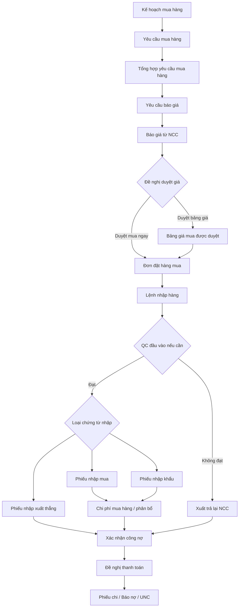

# BRAVO-BUSINESS-CONTEXT — Bản đồ nghiệp vụ nền cho AI Copilot

> Nguồn đọc: bộ mindmap tiếng Việt BRAVO 10 (`Mindmap_*.md`) và chương Purchase trong User Guide.
> Mục tiêu: đặt BRAVO ERP làm source-of-truth nghiệp vụ; AI chỉ hỗ trợ nhập nhanh, đối chiếu, giải thích và tạo nháp chờ duyệt.

## 1. Mô hình tổng quát của BRAVO

BRAVO 10 là ERP vận hành theo 4 lớp nghiệp vụ lặp lại ở hầu hết phân hệ:

1. **Danh mục nền**: tài khoản, đối tượng, vật tư, kho, loại giao dịch, thuế, tiền tệ, phòng ban, máy móc, ca làm việc, tiêu chuẩn QC.
2. **Chứng từ phát sinh**: đơn hàng, phiếu nhập/xuất, hóa đơn, phiếu thu/chi, báo nợ/báo có, phiếu kiểm tra QC, lệnh sản xuất, bảng công/lương.
3. **Quy trình kiểm soát**: kế thừa dữ liệu, duyệt chứng từ, ký số, khóa dữ liệu, phân quyền, audit log, hạn thanh toán, đối trừ công nợ.
4. **Báo cáo và xử lý định kỳ**: tồn kho, công nợ, giá vốn, giá thành, BCTC, thuế, dashboard quản trị, cảnh báo.

Do đó, AI không nên coi "bút toán" là đơn vị nghiệp vụ duy nhất. Trong BRAVO, bút toán thường là hệ quả của một chứng từ đã đủ căn cứ.

## 2. Các phân hệ và vai trò chính

| Phân hệ | Vai trò nghiệp vụ | Dữ liệu/chứng từ lõi |
|---|---|---|
| General Rules | Quy tắc thao tác, giao diện, cảnh báo đỏ/vàng, import/export, phím tắt | Explorer, Editor, Reporter, grid, validate |
| Masters | Khai báo nền để mọi chứng từ chạy đúng | tài khoản, đối tượng, thuế, tiền tệ, kho, vật tư, loại giao dịch |
| Documents | Khung chứng từ chung | phiếu thu/chi, báo nợ/có, hóa đơn bán, phiếu nhập mua, phiếu kho, bù trừ |
| Managements | Quản trị dữ liệu và dòng kiểm soát | đơn hàng/hợp đồng, công nợ hạn thanh toán, duyệt/ký, HĐĐT đầu vào |
| System | An toàn vận hành | audit log, khóa dữ liệu, phân quyền, scheduler, sao lưu, email |
| Purchase | Từ nhu cầu mua đến nhập hàng, công nợ, thanh toán | kế hoạch mua, yêu cầu mua, RFQ, báo giá, PO, lệnh nhập, phiếu nhập |
| Inventory | Quản lý nhập-xuất-tồn và giá vốn | kho/vị trí/lô/serial, nhập kho, xuất kho, điều chuyển, kiểm kê |
| Accounting | Kiểm soát tài chính-kế toán | tiền, công nợ, TSCĐ/CCDC, giá thành, cuối kỳ, BCTC, thuế |
| Sale | Bán hàng B2B | kế hoạch bán, báo giá, đơn bán, lệnh xuất, hóa đơn, thu tiền |
| Sales Retail | POS và bán lẻ | phiếu bán lẻ, phiên bán, voucher, điểm thưởng, hóa đơn tổng hợp |
| CRM | Trước và sau bán hàng | lead, prospect, opportunity, campaign, complaint, survey |
| QC | Kiểm soát chất lượng | IQC/PQC/OQC, tiêu chuẩn, phiếu kiểm tra, xử lý không phù hợp |
| Production | Hoạch định và thực thi sản xuất | BOM, kế hoạch, lệnh sản xuất, tiêu hao, sản lượng, OEE |
| Machine Management | Vòng đời thiết bị | hồ sơ máy, bảo dưỡng, sửa chữa, chứng chỉ, thanh lý |
| HRM | Nhân sự từ tuyển dụng đến lương | ứng viên, đào tạo, hồ sơ, công, lương, BHXH |
| Task | Điều phối công việc | dự án, WBS, Kanban/Gantt, giao việc, nghiệm thu |
| Mobile | Kênh thao tác di động | duyệt, chứng từ mobile, barcode, offline sync, dashboard |

## 3. Nguyên tắc thiết kế AI theo đúng BRAVO

1. **Chứng từ trước, hạch toán sau**: AI phải xác định loại chứng từ BRAVO cần lập trước khi gợi ý định khoản.
2. **Kế thừa dữ liệu là bằng chứng**: mọi đề xuất cần trỏ về nguồn như PO, lệnh nhập, hóa đơn, phiếu QC, phiếu nhập gốc.
3. **Không vượt quy trình duyệt**: mọi hành động ghi hoặc thay đổi trạng thái chỉ tạo draft chờ người duyệt.
4. **Không tự chế số**: số lượng, đơn giá, thuế, chiết khấu, công nợ, giá vốn phải đến từ chứng từ hoặc tính toán deterministic.
5. **Không bỏ qua khóa dữ liệu**: kỳ đã khóa, phân hệ đã khóa hoặc chứng từ đã khóa phải là chặn cứng.
6. **Phân quyền theo nghiệp vụ thật**: quyền không chỉ theo API, mà còn theo đơn vị cơ sở, kho, phòng ban, màn hình, lệnh chức năng và trường dữ liệu.
7. **Cảnh báo thay vì đoán**: thiếu PO, thiếu lệnh nhập, hóa đơn về trước/hàng về sau, lệch VAT, thiếu mã kho, lệch công nợ phải thành exception cho người xử lý.

## 4. Luồng mua hàng chuẩn làm baseline

### Chứng từ mua hàng phải phân biệt

| Loại chứng từ | Khi dùng | Hạch toán/nghiệp vụ chính |
|---|---|---|
| Phiếu nhập mua | Mua nội địa nhập kho | tăng 152/156, tăng 1331, tăng 331; bắt buộc mã kho đúng để tính giá vốn |
| Phiếu nhập khẩu | Mua quốc tế | thêm thuế NK 33332, TTĐB 3332, BVMT 3338, VAT nhập khẩu 33312; giá nhập kho gồm thuế nhập khẩu liên quan |
| Phiếu nhập xuất thẳng | Mua về sử dụng/xuất ngay | vừa nhập vừa xuất, Nợ thường vào tài khoản chi phí/sử dụng thay vì tồn kho |
| Chi phí mua hàng | Vận chuyển, bốc dỡ, lưu bãi, chạy thử | phân bổ vào giá trị hàng nhập theo giá trị/số lượng/trọng lượng |
| Xuất trả lại NCC | Sai quy cách, không đạt QC, kém phẩm chất | đảo Nợ/Có so với phiếu nhập, giảm công nợ theo chứng từ gốc |
| Đề nghị thanh toán | Sau khi đã xác nhận công nợ | là bước yêu cầu chi trả, không thay thế chứng từ mua hàng |

## 5. Hệ quả cho sản phẩm AI hiện tại

Thiết kế hiện tại `hóa đơn XML -> journal_entry draft` chỉ là một lát cắt AP. Để đúng BRAVO, nên đổi trọng tâm thành:

**BRAVO Purchase Voucher Assistant** thay vì chỉ **AP Invoice Journal Assistant**.

Luồng AI nên là:

1. Nhận nguồn: XML hóa đơn, PDF, PO, lệnh nhập, phiếu QC, phiếu nhập gốc, chi phí vận chuyển.
2. Phân loại nghiệp vụ: nhập mua, nhập khẩu, nhập xuất thẳng, chi phí mua, trả NCC, đề nghị thanh toán.
3. Đối chiếu nguồn: số lượng, đơn giá, VAT, chiết khấu, mã NCC, MST, mã kho, PO, QC, hạn thanh toán.
4. Tạo **draft chứng từ BRAVO** tương ứng.
5. Sinh định khoản dự kiến như phần giải thích/preview, không coi đó là artifact chính.
6. Người dùng duyệt, sửa, hoặc từ chối theo maker-checker.

## 6. Backlog nghiệp vụ nên ưu tiên

1. **Domain schema cho draft chứng từ BRAVO**: `purchase_receipt`, `import_purchase`, `purchase_delivery_note`, `purchase_expense`, `return_to_vendor`, `payment_request`.
2. **Lineage bắt buộc**: draft phải lưu nguồn kế thừa (`purchase_order_id`, `receipt_command_id`, `qc_result_id`, `invoice_key`, `original_receipt_id`).
3. **Gate phân loại nghiệp vụ**: nếu chỉ có hóa đơn mà thiếu hàng nhập/PO thì tạo draft `needs_review`, không tự xác nhận công nợ.
4. **Validator theo từng loại chứng từ**: mã kho bắt buộc cho nhập kho, thuế nhập khẩu chỉ cho phiếu nhập khẩu, nhập xuất thẳng phải có tài khoản sử dụng/chi phí.
5. **Duplicate invoice guard**: chặn trùng theo MST NCC + ký hiệu + số hóa đơn + ngày hóa đơn.
6. **Review UI theo chứng từ**: hiển thị tab nguồn, tab hàng hóa, tab thuế, tab định khoản, tab cảnh báo.
7. **RLS/permission theo BRAVO**: scope không chỉ theo phòng ban mà còn theo kho, đơn vị cơ sở, loại chứng từ và quyền lệnh chức năng.

## 7. Ranh giới an toàn cho agent

AI được làm:

- Bóc dữ liệu từ hóa đơn/tài liệu.
- Gợi ý map mã vật tư, NCC, thuế, tài khoản.
- Đối chiếu hóa đơn với PO/lệnh nhập/QC/phiếu nhập.
- Tạo nháp chứng từ và giải thích căn cứ.
- Cảnh báo lệch số, thiếu nguồn, trùng hóa đơn, vượt hạn mức, sai kỳ.

AI không được làm:

- Ghi thẳng ERP.
- Tự duyệt chứng từ.
- Tự sửa số để cân.
- Tự bỏ qua QC, PO, khóa dữ liệu hoặc phân quyền.
- Tự chọn nghiệp vụ khi thiếu bằng chứng; phải hỏi lại hoặc đưa vào `needs_review`.

## 8. Liên kết sang bản đồ AI/USP và taxonomy nguồn

Tài liệu này chỉ mô tả nền nghiệp vụ và ranh giới an toàn. Bản đồ khoảng trống theo vòng đời BA-dev-triển khai-hỗ trợ và các USP AI cụ thể nằm ở [BRAVO-AI-GAP-USP-MAP.md](BRAVO-AI-GAP-USP-MAP.md).

Chuẩn phân loại nguồn, metadata, query routing và bộ câu hỏi eval nghiệp vụ nằm ở [BRAVO-KB-TAXONOMY-EVAL.md](BRAVO-KB-TAXONOMY-EVAL.md).
