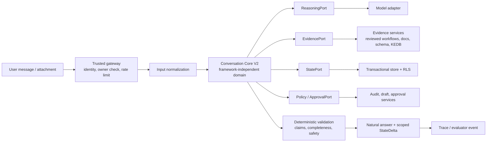

# BRAVO Conversation Core V2 — Core, Architecture, Process & Brainstorm

Status: **Working design / decision input — not an approved implementation specification**  
Scope: Conversation Core V2, starting with the **Financial Close Advisor** vertical slice  
Last consolidated: 2026-07-21  
Baseline observed: Git `f17d31c`; worktree was dirty when this note was written. Alembic head was **not verified** because the local `alembic` CLI was unavailable.  
Precedence: executable code, migrations, tests, runtime evidence, and accepted ADRs override this document. `docs/PROJECT-STATE.md` owns the current project snapshot.

## 1. Purpose

This document turns the V2 direction into one coherent working model: what the conversation core
is responsible for, where its boundaries sit, how a turn is processed, which evidence makes it
trustworthy, and which experiments should decide unresolved design choices.

It is deliberately not a full-platform rewrite plan. BRAVO already has valuable platform services
for identity, authorization/RLS, evidence, audit, drafts, approvals, artifacts, and deployment.
V2 replaces the **conversation reasoning and synthesis path** behind narrow ports only when those
services have been verified as safe to retain.

The outcome to prove is behavioral: a person trying to close a financial period gets a materially
more useful, safe, and correct next action than from the legacy path or the current Consultant
path. A diagram, typed schema, or passing route test is not that proof.

## 2. Current problem and target behavior

The observed weakness is not simply missing retrieval. Existing structures such as profile,
workflow, and task state can still be flattened into prompt text before a model produces a free-form
final answer. The result can be a polished paraphrase that omits causal prerequisites, blurs facts
and assumptions, or fails to adapt after a correction.

V2 treats a conversation as a small, governed decision process:

1. Understand the user’s intended outcome, not merely their wording.
2. Establish the smallest set of facts that changes the path: period, legal entity, environment,
   BRAVO version, current workflow state, authority, and risk.
3. Represent mandatory prerequisites and acceptable alternatives explicitly.
4. Plan the evidence needed for any exact, financial, schema, version, or execution claim.
5. Give a natural answer that says what to do next, how to verify it, and what remains uncertain.
6. Persist only a validated, scoped state transition; make corrections, cancellation, and task
   switching first-class events.

The target is helpful under uncertainty, not false precision. A missing environment-specific menu
path must produce conditional guidance plus a verification action—not an invented exact step and
not an unhelpful dead-end refusal.

## 3. Scope, non-goals, and invariants

### In scope for the first slice

- Financial Close Advisor: goal discovery; period/environment scope; posting, reconciliation,
  applicable period-end processing, closing, report readiness, control checks, correction,
  pause/cancel, and handoff.
- A framework-independent domain package with deterministic validation and fake adapters.
- A read-only evidence path, privacy-minimized trace, and one canonical chat integration path.
- Frozen A/B/C/D evaluation evidence and blind SME review.

### Explicit non-goals

- Rewriting FastAPI, Postgres, authentication, RLS, audit, approvals, or the entire UI.
- Automatic execution of generated SQL, configuration, postings, close actions, or external tools.
- Generic multi-agent orchestration, autonomous jobs, graph UI, or broad workflow expansion.
- Treating BravoGen output as ground truth or importing its wording into the knowledge base.
- Claiming production readiness, offline readiness, or superiority before the release and quality
  gates have measured evidence.

### Non-negotiable invariants

| Invariant | Architectural consequence |
|---|---|
| Authorization and RLS are outside the model | Identity, tenant, department, conversation ownership, and tool policy are resolved before the core runs; the database remains the backstop. |
| Exact claims require matching evidence | An answer cannot emit exact financial, schema, version, execution, or validated-result claims without an allowed evidence reference. |
| Mutations are draft/approval gated | The core may propose an action or handoff, never perform an irreversible action by itself. |
| Cloud egress is controlled and an offline-capable route remains verifiable | Model and retrieval adapters declare egress; no untracked external fallback is allowed. |
| State is correct under retries and concurrency | State deltas are revision-scoped, atomic, idempotent where needed, and auditable. |

## 4. Architectural thesis

Keep the trusted platform shell; create a clean core inside it. The core owns domain meaning and
decision contracts. Adapters own frameworks, storage, model calls, retrieval, transport, and
observability. The model can propose reasoning, but deterministic policy and validation decide what
may be persisted, cited, or presented as fact.



The core must run in unit tests with in-memory state, a fixed clock, fake evidence, and a fake
reasoning adapter. FastAPI, SQLAlchemy, a vector store, checkpoints, browser access, and a live
LLM are adapter concerns—not domain truth.

## 5. Boundary map

| Layer | Owns | Must not own |
|---|---|---|
| Trusted shell | Authentication, request authorization, RLS context, ingress, tenant ownership, rate limits | Task semantics, prerequisite logic, answer wording |
| Conversation Core | Task interpretation, prerequisite/evidence planning, answer contract, deterministic validation, state-transition intent | HTTP, ORM entities, vector queries, provider SDK calls, permission elevation |
| Evidence adapters | Source discovery, retrieval, source metadata, version/environment scope, redaction | Inventing missing facts or silently promoting unreviewed text |
| Reasoning adapter | Structured model input/output, retries within policy, provider-specific telemetry | Final safety judgment or durable business state |
| State adapter | CAS/row-lock persistence, idempotency records, task epochs, audit references | Reinterpreting domain state into an opaque checkpoint |
| Action/approval adapters | Draft creation, approval workflow, explicitly permitted read tools | Automatic execution based on model text |
| Evaluation service | Fixture replay, rubric scoring, blind packet generation, metrics | Changing production prompts or fixtures after freeze |

## 6. Core domain contracts

The names are intentionally concrete; their field-level shape should stabilize only through the
Financial Close slice and tests. Each contract must be serializable, versioned, and independently
validatable.

| Contract | Minimum purpose |
|---|---|
| `TaskBrief` | Interpreted outcome, selected profile, scope, constraints, risk, supplied facts, missing facts, and current task epoch. |
| `PrerequisitePlan` | Ordered or conditional nodes required for the outcome; alternatives, applicability conditions, completion evidence, and criticality. |
| `EvidencePlan` | Claims to ground, required source categories, scope constraints, freshness/effective-date needs, and allowed inference boundaries. |
| `EvidenceBundle` | Retrieved or supplied evidence items with provenance, owner, approval/effective status, version/environment scope, conflicts, and gaps. |
| `ReasoningProposal` | A structured proposal from the model: selected path, assumptions, questions, claim candidates, answer outline, and proposed next actions. |
| `AnswerDraft` | User-facing sections and individual claims linked to their support class: supplied, grounded, inference, conditional, or unknown. |
| `CriticReport` | Deterministic findings: unsupported exact claim, missing critical prerequisite, contradiction, unsafe action, insufficient context, or stale evidence. |
| `ConversationState` | Bounded active task, facts, task epoch, cancellation/correction markers, last revision, and references—not raw unbounded chat memory. |
| `StateDelta` | Validated add/change/remove operations scoped to an expected revision and task epoch; it is an intent, not an ORM update. |
| `ConversationTurnResult` | Final natural answer, clarification if needed, trace reference, safe handoff/draft references, and accepted state delta. |

### Contract rules

- A fact carries an origin: `user_supplied`, `evidence_grounded`, `domain_inference`,
  `model_hypothesis`, or `unknown`.
- Exact claims are only permitted from `user_supplied` or admissible `evidence_grounded` facts.
- Domain inference may explain why a step normally matters, but must not become an exact BRAVO
  screen, schema, version, balance, or validated-execution assertion.
- `StateDelta.expected_revision` and `task_epoch` are mandatory for persisted changes.
- Corrupt, incompatible, or missing persisted state is a visible recovery event. It must not be
  silently converted to an empty task.
- The core creates an action proposal only through a typed capability and approval boundary;
  free-text tool instructions have no execution authority.

## 7. Financial Close Advisor knowledge model

The core needs governed knowledge that is more structured than similar document chunks. The first
workflow graph is small and reviewable.

```text
Outcome: reliable financial statements for a defined period/entity
  ├─ Scope confirmed (period, entity, ledger, report basis, BRAVO environment/version)
  ├─ Source documents complete and posted
  ├─ Subledgers reconciled with the general ledger
  ├─ Applicable period-end processes completed
  │    └─ examples: allocation, depreciation, FX revaluation, accruals
  ├─ Closing / period-end entries completed and reviewed
  ├─ Opening balances, mappings, and report configuration checked
  ├─ Reports generated
  └─ Variances and control totals reviewed; exceptions are explained or approved
```

Every node needs: applicability criteria, criticality, allowed alternative, completion signal,
evidence type, and a safe answer pattern. For example, the advisor can say that reconciliation is
normally a prerequisite to a reliable report, while only a reviewed, scope-matching BRAVO source
may name the exact function or version-specific procedure.

## 8. Turn-processing process

### 8.1 Request lifecycle

```mermaid
sequenceDiagram
    participant User
    participant Shell as Trusted shell
    participant Core as Conversation Core
    participant Evidence as Evidence broker
    participant State as State store
    participant Model as Reasoning adapter

    User->>Shell: message / attachment
    Shell->>Shell: authenticate; authorize owner; set RLS context
    Shell->>State: load current state with authorized scope
    State-->>Shell: state + revision
    Shell->>Core: normalized request, policy, state snapshot
    Core->>Core: detect new goal, correction, cancellation, or task switch
    Core->>Core: build TaskBrief and PrerequisitePlan
    Core->>Evidence: request scoped EvidencePlan
    Evidence-->>Core: EvidenceBundle + gaps/conflicts
    Core->>Model: structured reasoning request
    Model-->>Core: ReasoningProposal
    Core->>Core: validate claims, completeness, safety, assumptions
    alt unsafe or insufficient exact evidence
        Core->>Core: revise to conditional guidance / targeted question
    end
    Core->>State: atomic StateDelta(expected revision, task epoch)
    State-->>Core: accepted revision or conflict
    Core-->>Shell: answer, trace reference, safe handoff/draft refs
    Shell-->>User: natural response
```

### 8.2 Detailed algorithm

1. **Contain and normalize.** The shell validates identity and conversation ownership before any
   memory read, state change, retrieval, model call, or tool availability decision. Normalize text,
   attachments, locale, and declared environment without converting private raw input into a broad
   trace.
2. **Classify the conversational event.** Detect whether this is a fresh task, answer refinement,
   correction, cancellation/pause, or a task switch. A task switch increments `task_epoch`; stale
   deltas from a prior epoch cannot apply.
3. **Form a `TaskBrief`.** Restate the intended outcome internally, bind known facts to their
   source, identify material unknowns, and assign risk. Route to a profile only as a reasoning
   policy bundle; profile choice does not widen authorization.
4. **Choose the highest-information next move.** If one fact changes the applicable close path,
   ask one focused question while still offering safe general guidance. Do not ask a questionnaire
   when the first practical next action is already safe.
5. **Build the prerequisite plan.** Select relevant nodes and conditions. A user asking to “open a
   financial report” receives readiness logic rather than a premature navigation answer.
6. **Plan and collect evidence.** Request only evidence that is permitted and relevant. Record
   absent, conflicting, stale, unapproved, or scope-mismatched evidence explicitly.
7. **Obtain a structured proposal.** The model returns an outline, assumptions, claim candidates,
   targeted clarification, and proposed safe actions. It never returns an executable command.
8. **Run deterministic critics.** Reject or rewrite unsupported exact claims; require critical
   prerequisites; flag conflict, stale scope, unsafe action, and ignored correction. The critic is
   an answer-construction gate, not a warning prefix appended after the answer.
9. **Synthesize natural language.** Prefer: outcome → what must be true → next actions → checks
   → uncertainty/one question. Hide internal chain-of-thought and mechanical pipeline labels.
10. **Persist safely and emit evidence.** Apply the state delta atomically. If the revision has
    changed, re-read and re-evaluate rather than overwriting. Store a privacy-minimized trace and
    evaluation event, then return the result.

## 9. Answer policy

### Required answer qualities

- State the interpreted goal in operational terms when that prevents misunderstanding.
- Explain applicable prerequisites in a useful order, with the reason each one matters.
- Separate confirmed facts, domain guidance, conditional branches, and unknowns.
- Provide concrete verification/control checks, not just navigation steps.
- Ask at most one high-information clarification unless safety requires otherwise.
- Acknowledge correction, cancellation, and changed environment explicitly.

### Hard failure rules

- Do not invent exact menu paths, fields, tables, schemas, version behavior, incident fixes, or
  financial values.
- Do not imply a report is reliable if mandatory close prerequisites remain unverified.
- Do not say an implementation, SQL, configuration, or posting was executed or validated without
  matching Workbench or approved execution evidence.
- Do not expose cross-tenant/department evidence, internal policy text, secrets, or raw private
  inputs in the response or trace.
- Do not bypass approval by converting a requested action into a persuasive natural-language step.

## 10. Ports and adapter responsibilities

```text
ConversationCore.handle(request, state, policy) -> ConversationTurnResult

Required ports
  ReasoningPort.propose(structured_context) -> ReasoningProposal
  EvidencePort.collect(EvidencePlan, authorization_scope) -> EvidenceBundle
  StatePort.load(scope, conversation_id) -> StateSnapshot
  StatePort.compare_and_swap(scope, delta) -> AppliedState | RevisionConflict
  PolicyPort.capabilities(scope, task) -> CapabilityPolicy
  AuditPort.record(minimized_trace) -> TraceRef
  ClockPort.now() -> Instant
```

The production adapter may initially use the incumbent model provider and existing retrieval
services. A fake adapter must make all important test cases deterministic. Switching model
providers or adding LangGraph/Pydantic AI must not change the domain contract or the evaluation
fixture format.

A new framework/service requires a brief ADR containing the measured failure it solves,
alternatives, operating cost, observability/security impact, exit path, rollback path, and a
fitness test that would fail without it.

## 11. Evidence, provenance, and trace design

### Evidence admissibility

An evidence item is usable only when its access scope, owner, effective/approval status,
environment/version scope, and retention/privacy classification are compatible with the current
request. A semantically similar text chunk is not enough for an exact claim.

The initial bundle should distinguish:

| Evidence class | Example | Use in answer |
|---|---|---|
| Reviewed workflow node | Close reconciliation requirement | Explain prerequisite and completion criteria |
| Versioned BRAVO guide | Specific supported operation | Cite exact operation only within its confirmed scope |
| Approved schema snapshot | Exact table/field/version fact | Use for technical exact claim only |
| KEDB/support case | Diagnosed symptom and verified resolution | Offer scoped diagnostic path; respect supersession |
| User-supplied fact | Customer says period is June 2026 | Treat as supplied context, not independently verified truth |
| Domain inference | Reconciliation normally precedes reliable reporting | Give conditional advisory guidance, never an exact product fact |

### Minimal trace fields

- request and conversation identifiers represented by protected references, not raw secrets;
- actor/tenant scope reference; task epoch and state revisions;
- selected profile, risk class, relevant prerequisite nodes, and policy version;
- evidence IDs plus admissibility/gap/conflict decisions;
- claim classifications and critic findings;
- model/reasoning adapter version, latency, token/cost telemetry where permitted;
- state-delta result, safe handoff/draft references, and evaluation fixture ID where applicable.

The trace must support audit and regression analysis without becoming a second unrestricted chat
transcript or a model-readable cross-tenant memory store.

## 12. Evaluation and evidence of success

### Systems under comparison

| ID | System |
|---|---|
| A | Legacy chat baseline |
| B | Current Consultant path |
| C | Conversation Core V2 |
| D | BravoGen in the correct native profile, used only as a behavioral comparator |

For A/B/C, freeze the same model/version, temperature, token budget, user input, attachments,
environment facts, and `EvidenceBundle`. Only then run ablations for model strength, live versus
oracle evidence, prerequisite planner, critic, and multi-turn state. This is how the team separates
model, corpus, retrieval, and architecture effects.

### Dataset and scoring

- Six development anchors are the rapid regression suite.
- The decision set is 24 frozen trajectories covering 66 turns.
- Add 30–50 redacted real-pattern conversations and an SME-held-out set before any broader claim.
- Blind and randomize outputs; calibrate at least two SMEs on the hard-failure rubric.
- Score outcome understanding (15%), prerequisite completeness (20%), BRAVO connection (20%),
  practical next action (15%), assumption/clarification control (10%), diagnostics/verification
  (10%), and natural conversation quality (10%).

Hard failures override weighted scores: fabricated exact facts, unsafe execution claims, skipped
mandatory prerequisites presented as complete, ignored correction/cancellation, or a superficial
paraphrase that does not resolve the real outcome.

### Adoption gate

Adopt V2 behind the existing shell only when all of the following are evidenced:

- C wins at least 60% of non-tied C-vs-D comparisons; lower confidence bound is above 50% before
  claiming it is better.
- Critical prerequisite recall is at least 90%; multi-turn correction fidelity is at least 95%.
- Zero unsafe execution claims and zero fabricated exact schema/version facts.
- No major regression in an evaluated family; held-out real-pattern task success improves over B.
- Required platform containment, migration, RLS, backup/restore, and air-gap evidence passes.

If only a stronger model produces the lift, adopt a model upgrade. If only oracle evidence works,
repair corpus/retrieval. If removing planner/critic/state removes the lift, the core architecture is
causal. If no option clears the gate, retain B as fallback and document the failure clusters rather
than adding frameworks or unrelated features.

## 13. Delivery process and stop gates

### Phase 0 — containment and reproducible baseline

Before changing V2 behavior: inventory the dirty worktree; create or name an immutable baseline;
record commit, dependency locks, Alembic head, redacted effective configuration, corpus manifest,
and Compose exposure; rotate any exposed provider credential through approved operations. Prove the
security/correctness gates in the V2 handoff: owner authorization, single final-answer guard,
atomic state transitions, idempotency order, corrupt-state recovery, RLS negative probes, safe
production ingress, and backup/restore.

**Stop gate:** no feature or prompt expansion until the containment tests and runtime evidence
exist. The current document does not assert that they do.

### Phase 1 — freeze behavior and truth

Freeze legacy A and Consultant B outputs before changing prompt, routing, retrieval, or synthesis.
Create Financial Close workflow nodes, evidence packs, must-not claims, expected outcomes, and
fixtures. Version every fixture and keep SME-held-out cases inaccessible to implementers.

**Stop gate:** a benchmark without matched controls, provenance, and blind review cannot decide
architecture.

### Phase 2 — build the thin core

Implement the contracts, fake ports, deterministic critics, state CAS semantics, and Financial
Close slice. Integrate through one canonical API/chat surface; sync, SSE, and alternate runtime
paths must share the same final safety/grounding gate.

**Stop gate:** no additional profile/workflow until Financial Close handles correction, pause,
cancel, evidence gaps, and unsafe-claim tests end to end.

### Phase 3 — evaluate causality

Run A/B/C smoke evaluation and targeted ablations. Fix the smallest demonstrated gap: domain model,
evidence admission, synthesis, critic, or state. Do not tune to BravoGen phrasing.

**Stop gate:** do not generalize contracts based on one speculative future use case.

### Phase 4 — rollout decision

Run the full blind benchmark, publish a bounded evidence report, and make an ADR decision: retain
B, strangler-adopt C, upgrade model/retrieval, or investigate a larger split only if measured
platform coupling failures justify it. A small stable canary must preserve instant rollback to the
frozen baseline.

## 14. Brainstorm backlog: hypotheses to test, not commitments

| Idea / question | Why it may help | Cheapest experiment | Decision signal |
|---|---|---|---|
| Typed prerequisite graph per workflow | Prevents answer synthesis from skipping causal steps | Hand-author 8–12 close nodes and compare C with planner removed | Material critical-recall and SME-preference lift |
| Claim ledger in `AnswerDraft` | Makes unsupported exact claims mechanically detectable | Require each sentence-level exact claim to carry support class | Zero fabricated exact claims without harming usefulness |
| Highest-information clarification selector | Reduces both premature advice and interrogations | Compare a fixed one-question policy with no-question and multi-question variants | Higher clarification information gain and task success |
| Evidence admissibility filter | Prevents stale/wrong-version documents from sounding authoritative | Inject conflicting/out-of-scope sources in fixture tests | Correct abstention/conditional behavior |
| State epochs plus CAS | Prevents old turns overwriting corrections/cancellations | Race and retry tests with two updates | No lost correction; clear conflict recovery |
| Structured answer outline before prose | Improves completeness without exposing chain-of-thought | Same evidence with free prose vs validated outline | Better rubric score, no unnatural response regression |
| Separate deterministic critic from model critic | Makes hard constraints testable | Run adversarial fake model proposals | All hard failures blocked or rewritten |
| Small read-only diagnostic tools | Could reduce uncertainty faster than more retrieved text | One scoped report/read capability with fixture replay | Improved next action without policy violations |
| Offline model adapter | Supports controlled egress/on-prem path | Air-gapped fake/local adapter smoke only after the core is stable | Same domain tests pass without cloud dependency |
| LangGraph or equivalent | May help only if real interrupt/resume branching exceeds a simple loop | Implement no earlier than two proven branching workflows | Measurable quality/operability benefit over simple adapter |

## 15. Open decisions to resolve with evidence

1. Which existing platform services pass the retain/wrap/replace review, and which ports are
   needed to isolate them?
2. What exact schema defines a “critical” Financial Close prerequisite, and who owns its review?
3. Which evidence metadata fields are already available versus needing a safe migration?
4. Where can final-answer safety currently be bypassed (sync, SSE, worker, MCP), and what single
   enforcement point covers all routes?
5. What is the minimum admissible evidence for an exact BRAVO version/menu claim?
6. Which redaction process and data-owner approval make real-pattern evaluation safe?
7. Does the selected model reliably produce the required structured proposal, or should the
   reasoning adapter employ constrained decoding/retry policy?
8. What response should be returned after a state revision conflict: automatic re-plan, explicit
   user notice, or both?
9. What is the smallest cold-host, zero-egress smoke test that can support the offline-capable
   claim without overclaiming production readiness?

## 16. Definition of done for the initial slice

The Financial Close Advisor slice is done when it is demonstrably able to:

- derive and retain a bounded `TaskBrief` across turns;
- select relevant close prerequisites and explain their applicability;
- distinguish evidence-grounded exact facts from conditional domain guidance;
- give a useful next action with verification checks when evidence is incomplete;
- handle user correction, task switch, pause, cancellation, and concurrent update safely;
- reject unsupported exact, financial, schema, version, and execution claims;
- create only approval-gated drafts/handoffs for mutations;
- emit privacy-minimized, evaluable traces; and
- clear the frozen, blind quality and platform gates above.

## 17. Relationship to canonical project documents

Read these before treating any section as an implementation instruction:

1. `docs/PROJECT-STATE.md` — current truth and verification limits.
2. `docs/AI-REVIEW-MANIFEST.md` — review precedence and evidence rules.
3. `plan-rebuild/08-V2-CONVERSATION-REBUILD-HANDOFF.md` — containment, sequence, and gates.
4. `plan-rebuild/04-WORKSPACE-REPO-COUNCIL-DECISION.md` — strangler boundary and complexity budget.
5. `plan-rebuild/07-CONVERSATION-INTELLIGENCE-BRAVOGEN-BENCHMARK.md` — conversation diagnosis and evaluation design.

This file consolidates those proposals for discussion. It does not supersede accepted ADRs or
replace fresh code, migration, test, security, and runtime verification.
