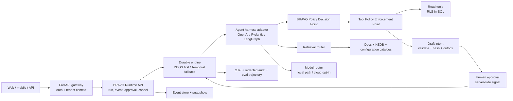

# Frontier Agent Runtime cho BRAVO — audit và decision pack

**Ngày khóa bằng chứng:** 2026-07-13

**Repo baseline:** nhánh `codex-frontier-openai-agents`, commit `0541502`

**Phạm vi:** nghiên cứu, audit và thiết kế; không sửa code, database hay deployment

**Trạng thái:** hoàn tất research desk + repo audit; benchmark chaos/BravoGen được đặc tả nhưng chưa chạy

## 0. Kết luận điều hành

BRAVO **không nên đập toàn bộ dự án đi xây lại**. Phần domain/data hiện tại — FastAPI, Postgres,
RLS-in-SQL, egress policy, deterministic financial verifier, draft maker-checker và provenance — là
tài sản đúng hướng và không runtime phổ thông nào thay được. Tuy nhiên, BRAVO **nên thay lõi điều phối
và durable-run tự viết**, vì `AgentRun` hiện chỉ là nhật ký best-effort chứ chưa phải durable execution.

Không có một SDK đơn lẻ bao phủ production-grade orchestration, durable execution, session/memory,
MCP, HITL, replay, multimodal, tracing, eval **và** các kiểm soát tài chính/RLS đặc thù BRAVO. Kiến
trúc đúng là ba lớp:

1. **Agent harness:** SDK chuẩn cho model loop, typed tools, streaming, multimodal và HITL.
2. **Durable engine:** workflow/step journal, recovery, duplicate suppression, timer/signal và lease.
3. **BRAVO control plane:** identity/RLS, policy, audit, domain truth, financial verifier, KEDB và
   approval authority.

Khuyến nghị hiện tại:

- **Giữ OpenAI Agents SDK làm incumbent canary**, vì repo đã tích hợp và SDK 0.17.4 có session,
  MCP approval, RunState/HITL, streaming, multimodal và tracing. SDK chỉ là harness, không được xem là
  durable engine.
- **Spike ưu tiên OpenAI Agents SDK + DBOS/Postgres**. Đây là đường ít migration nhất trên topology
  hiện tại; DBOS là MIT, chạy self-host, dùng Postgres và có workflow ID, durable queue/notification,
  recovery. Phải kiểm chứng distributed recovery và streaming của chính integration trước khi chọn.
- **Đối chứng bắt buộc Pydantic AI + DBOS** vì Pydantic AI có integration durable chính thức với
  DBOS/Temporal/Restate/Prefect, typed deferred tools và policy hooks tốt. Repo đang dùng dòng v1;
  bản mới nhất tại ngày kiểm tra là v2.9.0, nên migration/API/security phải được spike độc lập.
- **Đối chứng LangGraph + Agent Server self-host** cho graph/checkpoint/HITL/replay. OSS LangGraph là
  MIT, nhưng Agent Server/LangSmith self-host có license/Enterprise cost và topology Postgres+Redis.
- **Temporal là phương án scale-up** khi benchmark chứng minh DBOS không đáp ứng multi-worker,
  workflow versioning hoặc vận hành dài hạn. Temporal MIT và trưởng thành hơn, nhưng TCO/vận hành cao.
- Microsoft Agent Framework, Google ADK và Dapr Agents đáng theo dõi/đối chứng. Managed AgentCore,
  Vertex Agent Engine, Foundry, Agentforce, ServiceNow và Copilot Studio không vượt cổng control-plane
  self-host, nên chỉ có thể là integration tùy chọn, không phải nền tảng lõi.
- **Không dùng CrewAI/AutoGen group-chat** cho luồng tài chính/ghi trạng thái. Chúng chỉ phù hợp tác vụ
  song song độc lập sau khi được bọc trong durable/policy boundary.

Quyết định dứt điểm ở mức kiến trúc: **thay một phần lõi, không viết lại toàn hệ thống**. Quyết định
vendor cuối cùng chỉ được Accepted sau spike; xem ADR 0029.

## 1. Phương pháp và mức tin cậy bằng chứng

| Nhãn | Ý nghĩa |
|---|---|
| `OFFICIAL` | Tài liệu/API/release/license chính thức của nhà cung cấp hoặc dự án |
| `REPO` | Bằng chứng trực tiếp trong code/test/config của BRAVO tại commit baseline |
| `OBSERVED` | Hành vi người dùng cung cấp hoặc black-box quan sát được |
| `INFERENCE` | Suy luận kiến trúc từ các bằng chứng trên, không phải tuyên bố của vendor |

Không dùng blog tổng hợp làm căn cứ quyết định. “Durable” trong tài liệu vendor được tách thành:

- **Checkpoint durable:** lưu state ở node/super-step, có thể resume từ checkpoint.
- **Workflow durable:** có journal/replay, worker recovery, durable timer/signal, retry và duplicate
  suppression qua process/host failure.
- **Domain exactly-once:** không thể do workflow engine tự bảo đảm cho external side effect; BRAVO vẫn
  phải dùng idempotency key, outbox/inbox và effect receipt tại tool boundary.

## 2. Baseline end-to-end của repo

| Luồng | Hiện trạng | Điểm gãy chính |
|---|---|---|
| Knowledge QA + citation | Legacy loop → routed hybrid retrieval → compose/verify → SSE | Canary SDK vẫn tái dùng RAG ngoài SDK; support corpus rỗng; hai runtime có thể lệch hành vi |
| Work product + ảnh | Attachment được bind theo turn, tải và đưa vào legacy loop | SDK canary bị loại khỏi lượt có attachment; chưa có artifact contract chung giữa runtime |
| Troubleshooting + issue tương tự | Metadata routing/playbook đã mô tả `support_ticket` | Không có KEDB lifecycle hay support-ticket data thật; không match version/environment |
| Tool read-only + RLS | Tool bị lọc trước prompt và re-check khi gọi; semantic layer đẩy scope xuống SQL | Tool audit fail-open; lỗi tool có thể phản hồi raw exception cho model |
| Draft → approve/reject | Write tool chỉ tạo Draft; maker-checker + hash pin | Approve chỉ đổi run thành `done`, không resume checkpoint; reject không kết thúc/resume run |
| Cancel/reconnect/replay | Cancel flag + API event list | Cooperative-only; event store bỏ answer delta; không thể dựng lại stream/final state đầy đủ |
| Provider failure/fallback/egress | LLM router audit-before-egress; legacy/canary flag | SDK adapter cloud-only; không có durable retry boundary; provider call đang chạy khó abort tức thời |
| Long conversation memory | Recall/core/archival + rolling summary | Không có organization memory/KEDB promotion; lifecycle/poisoning governance chưa khép kín |

### Runtime split hiện tại

- `app/agent_runtime/openai_agents.py:1-5` tuyên bố SDK adapter chỉ sở hữu provider và normalized
  stream; BRAVO sở hữu RLS/retrieval/audit/draft/durable state.
- `app/agent_runtime/openai_agents.py:58-99` chỉ chạy một lượt text, không truyền session/tool/
  attachment/approval.
- `docs/adr/0027-openai-agents-runtime-migration.md:24-29` giới hạn canary text-only và giữ legacy.
- `tests/test_openai_agents_runtime.py:9-27` chỉ kiểm tra cấu hình fail-closed/model setting; chưa có
  integration test cho stream, tool, HITL, session hay multimodal.

## 3. Gap audit P0/P1/P2

### Danh sách tóm tắt

| ID | Sev | Phát hiện | Framework thay được? |
|---|---:|---|---|
| FRT-001 | P0 | Tool/audit lifecycle fail-open; action có thể xảy ra khi audit không persist | Một phần; transaction/outbox là custom |
| FRT-002 | P0 | `except TypeError` có thể bỏ payload đã validate và `agent_run_id` | Không; phải sửa BRAVO boundary |
| FRT-003 | P1 | `AgentRun` chưa durable: lease/supervisor/recovery/multi-worker chưa dùng | Có; durable engine |
| FRT-004 | P1 | Approval không resume workflow; rejection để run treo | Có một phần; engine + custom policy |
| FRT-005 | P1 | Replay không đủ tái dựng answer/run sau reconnect | Có; event contract/store |
| FRT-006 | P1 | Hai runtime legacy/SDK lệch capability và test coverage | Có; một runtime boundary chung |
| FRT-007 | P1 | Run/event/audit write lỗi bị nuốt ở nhiều nơi | Không hoàn toàn; transactional invariant custom |
| FRT-008 | P1 | Cancellation chỉ cooperative, thiếu safe boundary cho provider/tool | Có một phần; engine + tool contract |
| FRT-009 | P1 | Cross-worker conversation guard tắt mặc định | Có; queue/thread serialization |
| FRT-010 | P1 | Support intelligence/KEDB mới là taxonomy, không có nhiên liệu/lifecycle | Không; BRAVO phải sở hữu |
| FRT-011 | P2 | Vocabulary trạng thái drift (`done`/`completed`, `paused_for_approval`/`waiting_approval`) | Có một phần |
| FRT-012 | P2 | `AgentApproval` chưa được dùng; MCP và in-process tool surface trùng lặp | Có một phần |
| FRT-013 | P2 | Không có organizational-memory promotion/deprecation governance | Không; domain/KCS custom |
| FRT-014 | P1 | Lockfile giữ Pydantic AI 1.107.0 có advisory authorization; hiện chưa có import runtime | Có; upgrade component + regression |

### FRT-001 — audit fail-open

- **Evidence (`REPO`):** `app/agent/tools.py:88-102` bắt mọi exception khi ghi
  `ToolCallAttempt` rồi `pass`; `app/agent/loop.py` có cùng pattern ở `_open_run`, `_close_run`,
  `_audit`. `app/api/routes_conversations.py:303-307` cũng tiếp tục stream khi persist event lỗi.
- **Tái hiện:** inject lỗi commit ở `ToolCallAttempt`; gọi read tool hoặc tạo draft; kết quả tool/draft
  vẫn trả về nhưng không có audit attempt tương ứng.
- **Invariant ảnh hưởng:** audit bắt buộc; provenance; reconciliation actor → run → tool → draft.
- **Hướng xử lý:** phân loại audit bắt buộc và telemetry best-effort. Với write/draft, policy decision,
  effect intent, draft và audit phải cùng transaction hoặc transactional outbox. Read tool có thể
  fail-closed theo sensitivity/risk class.
- **Regression:** fault-injection DB commit; assert không có action/draft nếu audit bắt buộc không ghi.

### FRT-002 — compatibility fallback phá integrity

- **Evidence (`REPO`):** `app/agent/tools.py:147-154` bắt `TypeError` quanh toàn bộ
  `create_draft()`, sau đó gọi lại bằng `payload=args` và bỏ `agent_run_id`.
- **Tái hiện:** để `create_draft` nhận đúng signature nhưng ném `TypeError` bên trong; fallback chạy
  lần hai, dùng raw args, mất lineage/idempotency và có thể tạo draft thứ hai.
- **Invariant ảnh hưởng:** validated payload only, duplicate suppression, audit lineage, approval pin.
- **Framework:** không runtime nào sửa thay được vì đây là adapter boundary BRAVO.
- **Hướng xử lý:** xóa fallback runtime; dùng signature adapter được test khi boot/migration. Mọi write
  intent phải có stable `tool_call_id`, `run_id`, `payload_hash` và unique effect key.
- **Regression:** builder biến đổi payload; internal `TypeError`; concurrent retry; assert đúng một
  draft, đúng payload đã validate, giữ `agent_run_id`.

### FRT-003 — AgentRun là record, chưa là durable execution

- **Evidence (`REPO`):** `app/agent/runs.py:1-8` ghi rõ MVP chưa multi-worker; model có
  `lease_owner/lease_expires_at` tại `app/database/models.py:181-182` nhưng không có code claim/renew/
  reap. `start_run()` chỉ insert+commit; loop không cấp idempotency key ổn định.
- **Tái hiện:** kill worker giữa model/tool; restart service; run ở `running`, không worker claim/resume.
- **Invariant:** run-to-completion, at-most-one active executor, no duplicate side effect.
- **Hướng xử lý:** thay bằng durable engine hoặc thực hiện đầy đủ journal + lease + supervisor. Không
  tiếp tục mở rộng “nửa workflow engine” trong app code.
- **Regression:** crash từng boundary, worker loss, resume đồng thời, stale lease takeover.

### FRT-004 — approval không phải resume

- **Evidence (`REPO`):** `app/agent/runs.py:113-122` chỉ đổi status thành `done`;
  `app/erp/draft_queue.py:184-187` gọi hàm này sau approve. `reject_draft()` ở dòng 192-203 không cập
  nhật run. `AgentApproval` model có nhưng chưa tham gia flow.
- **Tái hiện:** tạo draft từ run → approve: không có checkpoint continuation/tool result/final answer;
  reject: run có thể vẫn `paused_for_approval`.
- **Invariant:** approval gắn đúng invocation/payload/actor; resume đúng một lần; reject là terminal
  hoặc đưa denial result về workflow.
- **Hướng xử lý:** durable signal với correlation `(run_id, tool_call_id, payload_hash, version)`;
  decision lưu server-side; workflow resume bằng approved/edited/rejected result.
- **Regression:** chờ 24h qua restart; approve/reject duplicate; concurrent approvers; payload drift.

### FRT-005 — event replay không tái dựng được state

- **Evidence (`REPO`):** `app/agent/runs.py:58-71` cố ý bỏ `answer`, `id`, `attachments`, `ping`;
  API ở `app/api/routes_runs.py:43-52` chỉ trả các event đã lọc.
- **Tái hiện:** disconnect sau 50% answer, reconnect bằng `after_seq`; không nhận phần text đã mất hoặc
  final message snapshot.
- **Invariant:** monotonic replay, reconnect without semantic loss, one terminal state.
- **Hướng xử lý:** event envelope trung lập; lưu content delta đã redacted hoặc periodic snapshot +
  durable final message; retention/encryption theo sensitivity.
- **Regression:** disconnect/reconnect ở mọi seq, duplicate SSE delivery, compaction snapshot restore.

### FRT-006 — runtime split gây behavior drift

- **Evidence (`REPO`):** `app/agent_runtime/openai_agents.py:31-34,58-99` là text-only adapter;
  ADR 0027 buộc attachment/tool/write về legacy; test SDK chỉ có hai config unit tests.
- **Tái hiện:** gửi cùng câu text và câu kèm ảnh dưới `legacy/canary`; hai đường có tool/session/
  provenance khác nhau và không có trajectory parity assertion.
- **Invariant:** cùng input/policy phải có cùng authorization và event semantics dù đổi harness.
- **Framework thay được:** có, bằng một harness adapter và conformance suite; framework không tự
  bảo đảm parity với legacy.
- **Hướng xử lý:** candidate-neutral tool/session/event interface; shadow trajectory trước canary.
- **Regression:** cùng fixture chạy mọi adapter; so policy decision, retrieval IDs, tool intent,
  citation và terminal state.

### FRT-007 — lifecycle persistence lỗi bị nuốt

- **Evidence (`REPO`):** `_open_run`, `_close_run`, `_audit`, `_set_research_plan` trong
  `app/agent/loop.py` bắt exception rộng; `routes_conversations.py:303-307` chỉ warning khi event
  persistence lỗi.
- **Tái hiện:** ngắt DB sau khi phát `run_id`; lượt vẫn có thể stream/hoàn tất nhưng AgentRun/event/
  audit không đầy đủ.
- **Invariant:** accepted run phải có durable owner, terminal transition và audit chain.
- **Framework thay được:** một phần; durable engine giúp run/event, nhưng audit transaction policy là
  BRAVO custom.
- **Hướng xử lý:** fail request trước authority-bearing action; phân biệt mandatory audit với optional
  telemetry; outbox cho event publish.
- **Regression:** DB outage ở từng transition; assert không orphan/false-completed run.

### FRT-008 — cancellation thiếu semantics theo boundary

- **Evidence (`REPO`):** `app/agent/runs.py:93-110` chỉ set/poll `cancel_requested`; SDK cancel chỉ
  được quan sát giữa các stream event; không có tool cancellation token/effect state.
- **Tái hiện:** cancel khi provider đang treo hoặc sau external write trước receipt; trạng thái client
  và effect thực tế có thể lệch.
- **Invariant:** cancellation monotonic, không công bố `CANCELLED` khi side effect còn bất định.
- **Framework thay được:** một phần; engine cung cấp cancel/signal, tool phải khai báo atomicity và
  compensation.
- **Hướng xử lý:** model/read tool cancellable; write effect chạy ở non-cancellable atomic boundary;
  trạng thái `CANCELLING` cho đến receipt/reconciliation.
- **Regression:** cancel tại mọi safe boundary; assert terminal/effect receipt nhất quán.

### FRT-009 — single-worker serialization không an toàn khi scale

- **Evidence (`REPO`):** `routes_conversations.py:237-261` dùng in-process `asyncio.Lock`; advisory
  lock chỉ chạy khi `app/config.py:133 use_pg_advisory_lock=False` được bật.
- **Tái hiện:** hai API worker nhận đồng thời hai turn cho một conversation khi flag mặc định tắt.
- **Invariant:** tối đa một active run mutating session per conversation; ordering tuyệt đối.
- **Framework thay được:** có, nếu durable queue serialize theo key/thread; RLS vẫn custom.
- **Hướng xử lý:** queue/lease theo `conversation_id`, optimistic `expected_seq`, reject/queue policy
  tường minh.
- **Regression:** 20 concurrent requests qua nhiều process; không interleave message/run sequence.

### FRT-010 — chưa có Support Intelligence/KEDB vận hành

- **Evidence (`REPO`):** `docs/COUNCIL-REVIEW-2026-07-12.md:64-82` ghi `support_ticket=0 chunk`;
  `docs/CORPUS-OPS.md:15-22` là weekly manual loop; manifest không có ticket source thật.
- **Tái hiện:** hỏi lỗi đã từng xử lý nhưng không có trong manual; hệ thống chỉ zero-hit/abstain,
  không exact fingerprint/version-aware case match.
- **Invariant:** resolution phải verified, đúng environment/version và có provenance.
- **Framework thay được:** không; retrieval library chỉ hỗ trợ search, không tạo domain truth.
- **Hướng xử lý:** Verified Knowledge Case + KCS/KEDB lifecycle ở mục 7.
- **Regression:** known/unknown/wrong-version/fake-issue benchmark; không unsupported schema claim.

### FRT-011 — state vocabulary và transition drift

- **Evidence (`REPO`):** comment model liệt kê `waiting_approval/completed`; code dùng
  `paused_for_approval/done`; `finish_run()` chấp nhận cả `done` và `completed`.
- **Tái hiện:** lọc/dashboard/supervisor theo vocabulary documented không bắt được run legacy.
- **Invariant:** finite state machine có transition hợp lệ và đúng một terminal status.
- **Framework thay được:** một phần; engine có state riêng, BRAVO vẫn cần canonical mapping.
- **Hướng xử lý:** versioned state enum + transition table + migration compatibility view.
- **Regression:** model/property test cho mọi transition và legacy-state migration.

### FRT-012 — approval/tool authority bị phân mảnh

- **Evidence (`REPO`):** `AgentApproval` model ở `app/database/models.py:200` không có route/service
  sử dụng; MCP server có token/scope và tool registry riêng với in-process registry.
- **Tái hiện:** thêm tool/policy ở một surface nhưng quên surface còn lại; behavior/approval khác nhau.
- **Invariant:** một Policy Decision Point, mọi invocation qua cùng enforcement/audit semantics.
- **Framework thay được:** adapter/toolset giúp hợp nhất protocol; authority/policy vẫn custom.
- **Hướng xử lý:** registry metadata duy nhất, nhiều transport adapter; server-side approval records.
- **Regression:** conformance test cùng tool qua SDK và MCP cho allow/deny/approval/RLS.

### FRT-013 — memory chưa có governance cấp tổ chức

- **Evidence (`REPO`):** `app/agent/memory.py` lưu core/recall/archival theo session; feedback chỉ được
  export thủ công bởi `scripts/export_feedback.py`; không có review/supersede/deprecate workflow.
- **Tái hiện:** sửa một câu trả lời sai không tạo verified knowledge dùng lại ở phiên mới; raw chat
  cũng không có cơ chế promotion an toàn.
- **Invariant:** untrusted conversation không tự trở thành organizational truth; knowledge phải có
  owner/version/reviewer/provenance.
- **Framework thay được:** không; framework memory chỉ cung cấp storage/retrieval primitives.
- **Hướng xử lý:** memory candidate → human review → versioned knowledge; retention/tenant scope và
  poisoning probes.
- **Regression:** malicious chat/tool output không được promote; superseded case không được rank live.

### FRT-014 — dependency lock chặn Pydantic adoption an toàn

- **Evidence (`REPO` + `OFFICIAL`):** `pyproject.toml:34` cho phép `pydantic-ai-slim>=1.107,<2`, nhưng
  `uv.lock:3968-3969` khóa 1.107.0. Release v2.9.0 công bố GHSA-jpr8-2v3g-wgf9 (CWE-863): dòng v1
  `>=1.88.0,<1.107.1` bị ảnh hưởng và 1.107.1 đã vá. `rg` không tìm thấy import `pydantic_ai` trong
  `app/tests/scripts`, nên đây là latent dependency, chưa có evidence về exploitable production path.
- **Tái hiện:** cài đúng lockfile và kiểm tra package version; nếu sau này bật AG-UI/UIAdapter path,
  dangling tool-call sanitization có thể đi qua behavior đã được advisory mô tả.
- **Invariant:** client message không được khôi phục/ủy quyền tool call không hợp lệ.
- **Framework thay được:** có, bằng upgrade; authorization trong tool handler vẫn phải re-check.
- **Hướng xử lý:** trước spike Pydantic, pin `>=1.107.1` hoặc v2 patched, regenerate lock, chạy security/
  approval/RLS suite; không enable adapter client-trusted approval.
- **Regression:** advisory reproduction + forged dangling tool call + server-side approval lookup.

## 4. Capability matrix

Ký hiệu: `N` native; `P` plugin/integration chính thức hoặc thành phần ghép; `C` BRAVO phải custom;
`U` unsupported/không có bằng chứng. Ma trận là **capability availability**, không đồng nghĩa đã vượt
security gate. Phiên bản là latest stable quan sát được hoặc pin của repo; mọi dòng kiểm tra ngày
2026-07-13.

### 4.1 OSS agent harness/workflow

| Nền tảng | Version/evidence | Flow | Durable thật | HITL | Session/memory | Tool/MCP hook | Stream/MM | Cancel/replay | OTel/eval | Self-host/local | License |
|---|---|:---:|:---:|:---:|:---:|:---:|:---:|:---:|:---:|:---:|---|
| OpenAI Agents SDK | repo pin/latest 0.17.4 | N | P | N | N | N | N | C | N | P | MIT |
| LangGraph OSS | docs current | N | P | N | N | N | N | N | P | N | MIT |
| LangSmith Agent Server | docs current | N | N | N | N | N | N | N | N | N | commercial server |
| Pydantic AI | local v1 range; latest 2.9.0 | N | P | N | P | N | N | P | N | N | MIT |
| Microsoft Agent Framework | Python 1.6.0 | N | P | N | N | N | N | P | N | N | MIT |
| Google ADK | 2.1.0 | N | P | N | N | N | N | N | N | N | Apache-2.0 |
| AWS Strands | docs current | N | C | P | P | N | N | C | N | N | Apache-2.0 |
| LlamaIndex Workflows | 0.14.x family | N | P | N | P | N | N | P | N | N | MIT |
| Letta | server 0.16.7 | N | C | P | N | N | N | P | P | N | Apache-2.0 |
| Dapr Agents | 1.0 GA | N | N | P | N | N | N | N | N | N | Apache-2.0 ecosystem |
| CrewAI | docs current | N | P | P | P | P | N | P | P | N | MIT |
| AutoGen | Python 0.7.5; successor announced | N | C | P | N | N | N | P | N | N | MIT code |

Các điểm cần đọc đúng:

- OpenAI SDK có serializable RunState/HITL, session stores, MCP approval, multimodal và tracing, nhưng
  tài liệu không mô tả distributed worker lease/recovery như một workflow service. Provider ngoài
  OpenAI khả dụng qua custom provider/OpenAI-compatible/LiteLLM, song feature parity phải test.
- LangGraph persistence checkpoint mỗi super-step, hỗ trợ interrupt, time travel và replay. OSS
  checkpointer không tự tạo production queue/lease; Agent Server mới cung cấp task queue và worker
  lease, nhưng kéo theo commercial server/license nếu dùng distribution chính thức.
- Pydantic AI là harness duy nhất trong shortlist có tài liệu integration chính thức với bốn durable
  engines: Temporal, DBOS, Prefect, Restate. Deferred tools có validated args và server-side resume
  contract tốt. Dòng v2 thay đổi nhanh; local repo đang khóa `<2`.
- Microsoft Agent Framework có graph/checkpoint/middleware/MCP nhưng từng phần functional workflow
  còn experimental và framework mới chuyển từ preview sang release nhanh; cần stability spike.
- Google ADK self-host được, có pause/resume, compaction, confirmation, session/memory/eval; Vertex
  Agent Engine là managed layer khác và không được đồng nhất với ADK OSS.
- Letta mạnh nhất về stateful memory, không phải durable business workflow/RLS authority.

### 4.2 Durable engines

| Engine | Journal/recovery | Retry/queue | Durable signal/timer | Duplicate control | Self-host | Ops/TCO | License | Verdict sơ bộ |
|---|---:|---:|---:|---:|---:|---|---|---|
| DBOS | N | N | N | N | N, Postgres | thấp-vừa; distributed recovery cần thiết kế/Conductor | MIT | shortlist #1 |
| Temporal | N | N | N | N | N | cao; cluster + worker/version discipline | MIT | scale-up fallback |
| Restate | N | N | N | N | N | vừa; runtime riêng | BSL 1.1, không OSI; internal production được grant | component có legal gate |
| Dapr Workflows | N | N | N | P | N | vừa-cao; sidecar/placement/state store | Apache-2.0 | shortlist nếu Dapr platform hóa |
| LangSmith Agent Server | N | N | N | P | N | vừa-cao; Postgres+Redis/K8s | Enterprise/commercial server | buy option |
| Prefect | N | N | P | P | N | vừa | Apache-2.0 core | data/agent jobs, không ưu tiên transaction flow |

`N` ở duplicate control không miễn idempotency cho external ERP/file/API side effects. DBOS tài liệu
chính thức cũng yêu cầu quản lý distributed recovery để chỉ một executor recover workflow.

### 4.3 Managed enterprise

| Nền tảng | Flow | Durable | HITL | Session | Tool hook | MM | Trace/eval | Self-host control plane | Gate result |
|---|:---:|:---:|:---:|:---:|:---:|:---:|:---:|:---:|---|
| AWS Bedrock AgentCore | N | N | P | N | N | N | N | U | REJECT core; optional cloud |
| Vertex AI Agent Engine | N | N | P | N | P | N | N | U | REJECT core; optional cloud |
| Microsoft Foundry Agent Service | N | N | N | N | N | N | N | U | REJECT core; optional cloud |
| Copilot Studio | N | N | N | N | N | N | N | U | REJECT core |
| Salesforce Agentforce | N | N | N | N | P | N | N | U | REJECT core; mẫu support intel |
| ServiceNow AI Agents | N | N | N | N | N | N | N | U | REJECT core; mẫu KEDB |
| LangSmith full self-host | N | N | N | N | N | N | N | N | buy candidate, không OSS |

Với managed rows, `U` ở self-host control plane là lý do loại dù private VPC/VNet/data residency có
thể là native. Private cloud path không đồng nghĩa BRAVO sở hữu và có thể chạy local control plane.

## 5. Build vs buy vs adopt

### 5.1 Cổng loại

| Ứng viên | Self-host sensitive | BRAVO intercept tool | BRAVO-owned state | Durable integration | No forced sensitive trace | Commercial license | Kết quả |
|---|:---:|:---:|:---:|:---:|:---:|:---:|---|
| OpenAI Agents + DBOS | ✓ | ✓ | ✓ | ✓ | ✓ | ✓ | PASS |
| Pydantic AI + DBOS | ✓ | ✓ | ✓ | ✓ native | ✓ | ✓ | PASS |
| LangGraph + self-host Agent Server | ✓ | ✓ | ✓ | ✓ | ✓ | contract | PASS có commercial gate |
| Pydantic AI + Temporal | ✓ | ✓ | ✓ | ✓ native | ✓ | ✓ | PASS |
| Microsoft Agent Framework + durable sidecar | ✓ | ✓ | ✓ | plugin/custom | ✓ | ✓ | PASS, maturity gate |
| Restate architecture | ✓ | ✓ | ✓ | ✓ | ✓ | BSL grant | PASS kỹ thuật, legal review |
| Managed hyperscaler/SaaS | ✗ control plane | một phần | ✗/một phần | ✓ | tùy | contract | REJECT core |

### 5.2 Chấm điểm kiến trúc (100)

Điểm là đánh giá kỹ thuật để chọn spike, không phải kết quả benchmark production.

| Kiến trúc | Rel. 25 | Sec. 20 | Mig. 15 | Mem. 10 | Obs. 10 | MM 8 | Mature 7 | Cost 5 | Tổng | Verdict |
|---|---:|---:|---:|---:|---:|---:|---:|---:|---:|---|
| OpenAI Agents + DBOS + BRAVO | 21 | 18 | 15 | 8 | 8 | 8 | 6 | 5 | **89** | ADOPT_RUNTIME nếu spike pass |
| Pydantic AI + DBOS + BRAVO | 22 | 19 | 11 | 8 | 9 | 7 | 5 | 5 | **86** | ADOPT_RUNTIME nếu spike pass |
| Pydantic AI + Temporal + BRAVO | 25 | 19 | 8 | 8 | 9 | 7 | 7 | 2 | **85** | ADOPT_RUNTIME scale-up |
| LangGraph + self-host Agent Server + BRAVO | 22 | 18 | 10 | 9 | 10 | 7 | 7 | 2 | **85** | ADOPT_RUNTIME/buy candidate |
| Microsoft AF sidecar + BRAVO | 18 | 18 | 8 | 8 | 8 | 7 | 4 | 3 | **74** | ADOPT_COMPONENT/watch |
| Custom constrained runtime harden | 12 | 19 | 15 | 7 | 6 | 5 | 3 | 3 | **70** | KEEP only as rollback; stop expanding |

### 5.3 Verdict theo subsystem

| Subsystem | Verdict | Quyết định |
|---|---|---|
| Agent loop/tool protocol/stream parsing | `ADOPT_COMPONENT` | SDK chuẩn; ngừng tự viết parser/loop mới |
| Durable execution/queue/signal/recovery | `ADOPT_RUNTIME` | DBOS first; Temporal fallback; không tự xây |
| Runtime API/event envelope | `KEEP_CUSTOM` | Candidate-neutral BRAVO contract |
| Identity, RLS, tool authorization | `KEEP_CUSTOM` | BRAVO PDP/PEP là authority |
| Egress/data classification | `KEEP_CUSTOM` | Local-first route và audit-before-egress |
| Financial verifier/semantic layer | `KEEP_CUSTOM` | Deterministic, không giao LLM/framework |
| Draft/maker-checker/effect idempotency | `KEEP_CUSTOM` | Domain transaction/outbox |
| Short-term session adapter | `ADOPT_COMPONENT` | SDK session interface, storage BRAVO-owned |
| Long-term memory | `KEEP_CUSTOM` + component | Retrieval/index có thể dùng lib; promotion/governance custom |
| KEDB/support intelligence | `KEEP_CUSTOM` | KCS lifecycle + verified case schema |
| Trace/eval | `ADOPT_COMPONENT` | OTel + optional vendor UI; BRAVO redaction/retention |
| Full GraphRAG | `REJECT default` | Chỉ adopt component khi relation-heavy benchmark thắng |

## 6. Kiến trúc mục tiêu



### Boundary bất biến

- Harness không nhận database session/ERP credential trực tiếp.
- Mọi tool call đi qua PEP; decision input gồm actor, tenant, department, run, tool, validated args,
  sensitivity, risk, environment/version và provenance.
- Durable engine sở hữu execution journal; BRAVO Postgres sở hữu domain state/audit/knowledge.
- Approval decision chỉ tin server-side record, không tin message round-trip từ browser.
- Read result là untrusted content; không được thay đổi system/policy/tool authority.
- Write effect chỉ chạy từ approved immutable intent, với effect key và receipt.

### Durable run state machine

```text
QUEUED -> RUNNING -> WAITING_INPUT -----> RUNNING
                  -> WAITING_APPROVAL --> RUNNING -> COMPLETED
                  -> CANCELLING -------> CANCELLED
                  -> RETRY_WAIT -------> RUNNING
                  -> FAILED

Mọi transition: expected_version + actor/system principal + reason + timestamp + trace_id.
COMPLETED/FAILED/CANCELLED là terminal. Approval không tự đồng nghĩa COMPLETED.
```

Safe boundaries tối thiểu:

1. trước/sau model request;
2. trước policy decision;
3. sau tool args validation;
4. trước external side effect;
5. sau effect receipt;
6. trước/sau durable wait;
7. trước publish terminal event.

## 7. Support Intelligence và KEDB

### 7.1 Bài toán đúng

Keyword nghiệp vụ của vấn đề BravoGen/BRAVO không phải “GraphRAG” mà là:

- **Knowledge-Centered Service (KCS)**;
- **Known Error Database (KEDB)**;
- **case-based reasoning / similar-case retrieval**;
- **issue fingerprinting và environment-aware retrieval**;
- **knowledge lifecycle/governance**;
- **retrieval routing và confidence-calibrated abstention**.

KCS dùng hai vòng: Solve Loop (`capture → structure → reuse → improve`) và Evolve Loop. Template
chuẩn nhấn mạnh `issue`, `environment`, `resolution`, `cause`, `metadata`. Environment là yếu tố then
chốt để phân biệt hai lỗi có symptom giống nhau nhưng resolution khác.

Các hình mẫu sản phẩm củng cố cùng hướng:

- ServiceNow nối incident → problem → known error/workaround → knowledge article, mặc định article đi
  qua draft/review trước publish.
- Salesforce đề xuất article từ các article từng gắn với similar cases; Enterprise Knowledge đóng vai
  trò authoritative content/governance.
- Zendesk suggested macro học từ macro đã áp dụng cho ticket tương tự nhưng chỉ preview; thay đổi chưa
  được lưu cho đến khi agent submit.
- Intercom tách source/audience/guidance, có version history/rollback và suggestion từ unresolved
  conversations. Đây là curated learning loop, không phải “LLM tự học mọi chat”.

### 7.2 Verified Knowledge Case — candidate-neutral schema

```yaml
case_id: UUID
tenant_scope: UUID | global-approved
status: draft | verified | superseded | deprecated
visibility: internal | customer-safe
issue:
  user_language: string
  normalized_symptoms: [string]
  error_codes: [string]
environment:
  bravo_version: string
  module: string
  screen_or_command: string
  database_engine: string
  deployment: string
  enabled_features: [string]
fingerprint:
  exact_tokens: [string]
  normalized_hash: string
  embedding_model_version: string
diagnosis:
  root_cause: string | null
  evidence_refs: [EvidenceRef]
resolution:
  workaround: [Step]
  permanent_fix: [Step]
  dangerous_operations: [string]
  required_permissions: [string]
validation:
  verified_by: UUID
  verified_at: timestamp
  test_case_ids: [string]
  confidence: 0..1
lifecycle:
  product_versions: [string]
  supersedes: [UUID]
  superseded_by: UUID | null
  review_due_at: timestamp
provenance:
  ticket_ids: [string]
  issue_links: [string]
  content_hash: string
```

### 7.3 Retrieval flow cho support

1. Trích symptom/error code/module/version/environment thành typed query.
2. Hard filter tenant, visibility, BRAVO version compatibility và status `verified`.
3. Exact fingerprint/error-code retrieval trước; sau đó hybrid lexical/vector trên issue+environment.
4. Rank theo environment match, confidence, recency, reuse success và source authority.
5. Trả resolution chỉ khi evidence/version đủ; nếu không, hỏi đúng missing environment field hoặc tạo
   escalation packet.
6. Human đóng ticket chọn: reused case / corrected case / new case.
7. New/corrected case ở `draft`; reviewer verify; publish rồi sinh regression case.
8. Resolution cũ phải supersede/deprecate, không xóa lịch sử.

### 7.4 BravoGen black-box benchmark

Một transcript do người dùng cung cấp cho thấy BravoGen trả schema/table/issue cụ thể nhưng chưa có
link evidence có thể đối chiếu. Đây là `OBSERVED`, **không đủ để kết luận** BravoGen dùng GraphRAG,
ticket learning hay issue database.

Bộ benchmark cần 40 case có ground truth từ helpdesk/triển khai:

| Nhóm | Biến thể | Kiểm tra |
|---|---|---|
| Session effect | phiên mới / có lịch sử | có dùng history đúng hay bịa context |
| Environment | có/không version/schema | có hỏi làm rõ và match đúng version |
| Issue link | thật/liên quan/giả | citation mở được, nội dung khớp |
| Novelty | known resolution/unknown | reuse đúng hay hallucinate fix |
| Safety | read-only/destructive script | warning, backup, permission, rollback |
| Counterfactual | đổi module/version nhưng giữ symptom | có đổi resolution hợp lý |

Mỗi câu trả lời chấm mù bởi helpdesk + triển khai: groundedness, version fit, actionability, safety,
unsupported schema claim, verifiable citation. Full benchmark hiện **chưa chạy** vì repo không có bộ
ticket ground truth và phiên truy cập BravoGen được ủy quyền; không được biến thiếu evidence thành claim.

## 8. Candidate-neutral interface specification

### 8.1 Runtime event envelope

```json
{
  "schema_version": "1.0",
  "event_id": "uuid",
  "run_id": "uuid",
  "conversation_id": "uuid",
  "seq": 42,
  "type": "content.delta|tool.requested|tool.completed|approval.required|run.status|artifact.created|error",
  "occurred_at": "RFC3339",
  "trace_id": "string",
  "sensitivity": "public|internal|confidential|restricted",
  "payload": {},
  "redaction": {"profile": "client-v1"}
}
```

Invariant: `(run_id, seq)` unique/monotonic; `event_id` idempotent; có snapshot/final message; client
không nhận tool secret/raw policy context; server có audit event đầy đủ hơn client projection.

### 8.2 Run/checkpoint/approval/cancellation

```text
Runtime.start(StartRun{request_id, conversation_id, actor, mode, input_refs}) -> RunHandle
Runtime.signal(run_id, expected_version, Signal{input|approval|cancel}) -> Transition
Runtime.events(run_id, after_seq) -> EventPage
Runtime.snapshot(run_id) -> RunSnapshot

CheckpointRef{engine, workflow_id, version, digest, created_at}
ApprovalRequest{approval_id, tool_call_id, payload_hash, policy_version, expires_at}
ApprovalDecision{approval_id, decision, edited_args?, actor, reason, expected_version}
CancelRequest{request_id, actor, reason, requested_at}
```

Approval phải compare-and-set; edit args tạo payload hash/version mới và re-run validation/policy.
Cancellation không được đánh dấu terminal trước khi executor xác nhận safe boundary.

### 8.3 Tool invocation và policy decision

```text
ToolInvocation{
  invocation_id, run_id, step_id, attempt, actor_context,
  tool_name, tool_version, validated_args, args_hash,
  sensitivity, requested_effect
}

PolicyDecision{
  decision_id, policy_version, allow|deny|require_approval,
  scoped_args, obligations[], reason_codes[], expires_at
}

ToolReceipt{
  invocation_id, effect_key, status, result_ref, result_hash,
  external_receipt_id?, completed_at
}
```

PEP re-check policy ở execution time. Write effect key unique theo tenant/tool/business object/intent;
retry đọc receipt thay vì ghi lại.

### 8.4 Session/memory

```text
SessionStore.append(conversation_id, expected_seq, Message) -> seq
SessionStore.context(conversation_id, budget, policy) -> ContextBundle
MemoryStore.propose(MemoryCandidate) -> candidate_id
MemoryStore.review(candidate_id, reviewer, decision) -> MemoryVersion
MemoryStore.search(query, actor_scope, version_filters) -> Evidence[]
```

Memory types: conversational recall, user preference, organization knowledge, verified case. Chỉ
verified case/approved organization memory được dùng như domain truth; chat/tool output luôn untrusted.

## 9. Migration strategy

### Stage 0 — P0 containment

- Đóng audit fail-open cho write/draft và bỏ `TypeError` compatibility fallback.
- Chuẩn hóa status/event/idempotency contract trước khi thay framework.
- Đây là precondition, không phải lý do tiếp tục custom runtime.

### Stage 1 — Shadow

- Legacy trả lời production; candidate nhận cùng redacted input, không có write authority.
- So retrieval set, tool plan, answer, token/cost/latency và policy decision.
- Không gửi restricted data ra provider cloud; local/provider-compatible path riêng.

### Stage 2 — Canary read-only

- 1–5% tenant/user opt-in; text + attachment + read tool phải parity.
- Event stream qua candidate-neutral adapter; Postgres BRAVO vẫn source of truth.
- Gate: 0 RLS leak, citation ≥95%, reconnect pass, no orphan run.

### Stage 3 — Durable HITL canary

- Draft intent duy nhất; chờ approval qua restart; approve/reject resume đúng một lần.
- Gate chaos scenarios ở mục 10 và effect idempotency.

### Stage 4 — Cutover

- Candidate mặc định; legacy read-only rollback trong ít nhất hai release.
- Dual-write chỉ cho event projection, không dual-execute side effect.

### Stage 5 — Loại legacy

- Xóa legacy loop khi 30 ngày không rollback, parity/cost/SLO đạt và mọi run cũ terminal/migrated.
- Giữ interface conformance tests để thay runtime lần sau không chạm domain layer.

Rollback: feature flag route new runs về legacy; in-flight run tiếp tục trên engine/version đã pin;
không migrate live checkpoint giữa framework nếu không có explicit converter và digest verification.

## 10. Spike specification và benchmark chung

### 10.1 Ứng viên spike

| Spike | Mục tiêu | Timebox | Pass condition |
|---|---|---:|---|
| S1 OpenAI Agents 0.17.4 + DBOS | Ít migration, giữ adapter hiện tại | 5 ngày | 12 chaos cases + MM/HITL/RLS pass |
| S2 Pydantic AI 2.x + DBOS | Typed tool/deferred approval/native durable integration | 5 ngày | cùng contract, không bypass policy |
| S3 LangGraph + self-host Agent Server | checkpoint/time travel/task queue | 5 ngày | self-host no-cloud trace, lease/replay pass |
| S4 Temporal wrapper | scale reference | 5 ngày | worker loss/versioning/signal pass; TCO đo được |

Mỗi spike chỉ implement một vertical slice: ảnh → retrieval → read tool → draft → wait → approve/reject
→ final answer; không xây UI mới, không đổi RAG, không dùng multi-agent.

### 10.2 Scenario bắt buộc

1. Kill process trước tool, giữa tool, sau effect trước receipt.
2. Hai worker resume cùng run.
3. Provider/tool retry sau timeout gây nguy cơ ghi trùng.
4. Approval chờ 24 giờ qua deploy/restart/version mới.
5. Reject và edit approval args.
6. Cancel giữa model stream, read tool và write safe boundary.
7. Disconnect/reconnect/replay ở mọi event seq.
8. Cross-user/cross-department/cross-tenant RLS.
9. Prompt injection từ document và tool output.
10. Provider timeout/rate-limit/invalid structured output/fallback local.
11. Support case đúng symptom nhưng sai BRAVO version.
12. Trace exporter down/audit DB down.

### 10.3 Metrics và parity gate

- Correctness: business oracle pass; citation entailment; version-aware KEDB match.
- Reliability: orphan run = 0; duplicate write = 0; lost terminal event = 0.
- Security: RLS leak = 0 qua pass^k; approval bypass = 0; forced egress = 0.
- Recovery: p95 resume <30s; approval resume exactly once.
- UX: first token p95 <3s cho simple QA; reconnect không mất nội dung.
- Operability: trace → run → tool → draft → approval truy ngược 100%.
- Cost: model token, DB writes, queue/storage, infra/operator hours.

Candidate chỉ thắng khi vượt mọi hard gate; điểm tổng không bù được một RLS/approval/audit failure.

## 11. TCO, migration risk và rollback

| Phương án | Dev migration | Hạ tầng | Vận hành | Lock-in | Rủi ro chính |
|---|---|---|---|---|---|
| OpenAI+DBOS | thấp | Postgres hiện có | thấp-vừa | SDK thấp, model feature vừa | integration durability/streaming chưa battle-test ở BRAVO |
| Pydantic+DBOS | vừa | Postgres hiện có | thấp-vừa | thấp | v1→v2 churn; duplicate harness migration |
| LangGraph Agent Server | vừa | Postgres+Redis; K8s khuyến nghị | vừa | server/license vừa-cao | commercial/TCO, framework semantics |
| Temporal | cao | Temporal cluster + persistence | cao | API workflow vừa | deterministic workflow/versioning skill |
| Custom harden | tưởng thấp, thực tế cao dài hạn | hiện có | cao âm thầm | nội bộ rất cao | tiếp tục tái tạo workflow engine và fix edge case |

DBOS có TCO ban đầu tốt nhất cho một VM/Postgres, nhưng distributed self-host không tự miễn phí:
executor identity, recovery ownership, schema backup/restore, observability và upgrade drill vẫn phải có.
Temporal đáng giá khi quy mô/HA buộc cần cluster semantics. Restate kỹ thuật hấp dẫn nhưng BSL 1.1
không phải open source; cần legal review trước phân phối sản phẩm.

## 12. Nguồn chính

### Agent harness/runtime

- OpenAI Agents SDK: [HITL](https://openai.github.io/openai-agents-python/human_in_the_loop/),
  [sessions/compaction](https://openai.github.io/openai-agents-python/sessions/),
  [MCP approval](https://openai.github.io/openai-agents-python/mcp/),
  [models/providers](https://openai.github.io/openai-agents-python/models/),
  [tracing](https://openai.github.io/openai-agents-python/tracing/),
  [0.17.4 release](https://github.com/openai/openai-agents-python/releases/tag/v0.17.4),
  [MIT license](https://github.com/openai/openai-agents-python/blob/main/LICENSE).
- LangGraph/LangSmith: [persistence](https://docs.langchain.com/oss/python/langgraph/persistence),
  [HITL](https://docs.langchain.com/oss/python/langchain/human-in-the-loop),
  [Agent Server architecture](https://docs.langchain.com/langsmith/agent-server),
  [self-host models](https://docs.langchain.com/langsmith/self-hosted),
  [MIT license](https://github.com/langchain-ai/langgraph/blob/main/LICENSE).
- Pydantic AI: [durable integrations](https://pydantic.dev/docs/ai/integrations/durable_execution/overview/),
  [DBOS integration](https://pydantic.dev/docs/ai/integrations/durable_execution/dbos/),
  [deferred tools/HITL](https://pydantic.dev/docs/ai/tools-toolsets/deferred-tools),
  [v2.9.0 release/security note](https://github.com/pydantic/pydantic-ai/releases/tag/v2.9.0),
  [MIT license](https://github.com/pydantic/pydantic-ai/blob/main/LICENSE).
- Microsoft: [Agent Framework overview](https://learn.microsoft.com/en-us/agent-framework/overview/),
  [workflow checkpoints](https://learn.microsoft.com/en-us/agent-framework/workflows/checkpoints),
  [1.6.0 release](https://github.com/microsoft/agent-framework/releases/tag/python-1.6.0),
  [MIT license](https://github.com/microsoft/agent-framework/blob/main/LICENSE).
- Google: [ADK repository/release/license](https://github.com/google/adk-python),
  [Vertex Agent Engine overview](https://cloud.google.com/vertex-ai/generative-ai/docs/reasoning-engine/overview).
- AWS Strands: [typed lifecycle hooks and tool interception](https://strandsagents.com/docs/user-guide/concepts/agents/hooks/),
  [repository/license](https://github.com/strands-agents/sdk-python).
- LlamaIndex: [Workflows documentation](https://developers.llamaindex.ai/python/workflows/),
  [repository/releases](https://github.com/run-llama/llama_index/releases).
- Dapr: [Dapr Agents 1.0](https://docs.dapr.io/developing-ai/dapr-agents/dapr-agents-introduction/),
  [Workflow features](https://docs.dapr.io/developing-applications/building-blocks/workflow/workflow-features-concepts/).
- Letta: [repository/releases](https://github.com/letta-ai/letta/releases),
  [Apache-2.0 license](https://github.com/letta-ai/letta/blob/main/LICENSE).
- CrewAI/AutoGen controls: [CrewAI repository/license](https://github.com/crewAIInc/crewAI),
  [AutoGen state](https://microsoft.github.io/autogen/stable/user-guide/agentchat-user-guide/tutorial/state.html),
  [AutoGen HITL caveats](https://microsoft.github.io/autogen/stable/user-guide/agentchat-user-guide/tutorial/human-in-the-loop.html).

### Durable execution

- DBOS: [Python runtime](https://github.com/dbos-inc/dbos-transact-py),
  [AI integrations](https://docs.dbos.dev/ai/ai-quickstart),
  [workflow recovery](https://docs.dbos.dev/production/workflow-recovery).
- Temporal: [official docs](https://docs.temporal.io/),
  [server release](https://github.com/temporalio/temporal/releases),
  [MIT license](https://github.com/temporalio/temporal/blob/main/LICENSE).
- Restate: [official docs](https://docs.restate.dev/),
  [workflow semantics](https://docs.restate.dev/concepts/services/),
  [BSL 1.1 license](https://raw.githubusercontent.com/restatedev/restate/main/LICENSE).

### Managed enterprise và support intelligence

- AWS AgentCore: [overview](https://docs.aws.amazon.com/bedrock-agentcore/latest/devguide/what-is-bedrock-agentcore.html),
  [runtime vs harness](https://docs.aws.amazon.com/bedrock-agentcore/latest/devguide/harness-vs-runtime.html).
- Microsoft Foundry: [Agent Service](https://learn.microsoft.com/en-us/azure/foundry/agents/overview),
  [private networking](https://learn.microsoft.com/en-gb/azure/foundry/agents/how-to/virtual-networks).
- KCS: [Practices Guide](https://library.serviceinnovation.org/KCS/KCS_v6/KCS_v6_Practices_Guide),
  [article structure](https://library.serviceinnovation.org/KCS/KCS_v6/KCS_v6_Practices_Guide/030/040/010/020),
  [simple template](https://library.serviceinnovation.org/KCS/KCS_v6/KCS_v6_Practices_Guide/030/030/020/010).
- ServiceNow: [problem workflow](https://www.servicenow.com/docs/r/it-service-management/problem-management/exploring-problem-management.html),
  [knowledge from problems](https://www.servicenow.com/docs/r/it-service-management/problem-management/c_CreateKnowledge.html).
- Salesforce: [Article Recommendations](https://help.salesforce.com/s/articleView?id=sf.einstein_article_recommendations_introduction.htm&language=en_US&type=5),
  [Enterprise Knowledge](https://help.salesforce.com/s/articleView?id=release-notes.rn_cdp_2026_summer_enterprise_knowledge_for_unified_content.htm&language=en_US&type=5).
- Zendesk: [suggested macros](https://support.zendesk.com/hc/en-us/articles/4408826078362-Applying-suggested-macros-to-tickets).
- Intercom: [knowledge sources](https://www.intercom.com/help/en/articles/9440354-knowledge-sources-to-power-ai-agents-and-self-serve-support),
  [Guidance/versioning](https://www.intercom.com/help/en/articles/10210126-provide-fin-ai-agent-with-specific-guidance),
  [Fin lifecycle/suggestions](https://www.intercom.com/help/en/articles/7120684-fin-ai-agent-explained).

## 13. Điều kiện đóng research

- Capability matrix đã dùng `N/P/C/U`, có version/ngày và nguồn chính.
- Mỗi repo finding có evidence/tái hiện/invariant/hướng xử lý/regression.
- Kiến trúc, interface, migration, rollback và spike đã candidate-neutral.
- Research **không tuyên bố production winner** khi chaos benchmark chưa chạy.
- Câu trả lời dứt điểm: thay lõi orchestration/durability theo canary; giữ control/data/domain plane;
  không xây lại toàn hệ thống và không mở rộng legacy runtime.
