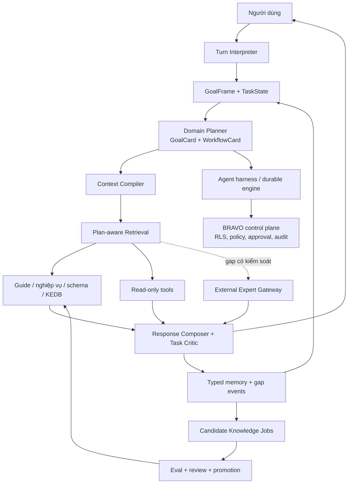

# BRAVO Consultant Intelligence v2 — master decision pack

> **Status: SUPERSEDED RESEARCH PROPOSAL.** Its implementation experiment remains evidence, but
> the current conversation benchmark and two-track boundary are owned by
> [../../../plan-rebuild/07-CONVERSATION-INTELLIGENCE-BRAVOGEN-BENCHMARK.md](../../../plan-rebuild/07-CONVERSATION-INTELLIGENCE-BRAVOGEN-BENCHMARK.md)
> and [../../../plan-rebuild/04-WORKSPACE-REPO-COUNCIL-DECISION.md](../../../plan-rebuild/04-WORKSPACE-REPO-COUNCIL-DECISION.md).

**Ngày chốt:** 2026-07-14  
**Trạng thái:** proposed; sẵn sàng bắt đầu Phase 0 sau khi product owner và chuyên gia nghiệp vụ duyệt 10 workflow ưu tiên  
**Phạm vi:** chất lượng hiểu mục tiêu, suy luận nghiệp vụ BRAVO 10, hội thoại nhiều lượt, retrieval theo kế hoạch, học từ khoảng trống  
**Không thay thế:** [Frontier Agent Runtime Decision Pack 2026-07-13](../FRONTIER-AGENT-RUNTIME-DECISION-PACK-2026-07-13.md)

## 1. Quyết định điều hành

Decision pack cũ giải đúng bài toán **runtime**: harness, durable execution, approval, audit,
RLS và tool policy. Chất lượng hội thoại hiện tại thấp không phải bằng chứng cần đổi runtime. Nó cho
thấy còn thiếu một lớp phía trên runtime: **BRAVO Consultant Intelligence Layer**.

Lớp mới phải biến một câu hỏi tự nhiên thành:

1. mục tiêu thật của người dùng;
2. trạng thái và điều kiện còn thiếu;
3. workflow nghiệp vụ cần hoàn thành;
4. hành động tương ứng trong BRAVO 10;
5. dữ kiện nào có thể trả lời tổng quát, dữ kiện nào phải tra theo version/environment;
6. bước tiếp theo hữu ích, an toàn và có thể kiểm chứng.

Ví dụ, với “làm sao lên báo cáo tài chính?”, câu trả lời tốt không bắt đầu và kết thúc bằng đường
dẫn mở báo cáo. Agent phải nhận ra mục tiêu `financial_statements_ready`, xác định kỳ, trạng thái
ghi sổ và dữ liệu đầu vào; kiểm tra hạch toán, phân bổ/khấu hao, đối chiếu, đánh giá cuối kỳ và kết
chuyển phù hợp; sau đó mới hướng dẫn lập/kiểm tra báo cáo trên BRAVO. Tên màn hình cụ thể có thể
phụ thuộc phiên bản và cấu hình, nhưng chuỗi nghiệp vụ cốt lõi vẫn phải được hiểu.

## 2. Kiến trúc được chọn

Các quyết định bắt buộc:

- Một **conversation owner** duy nhất chịu trách nhiệm câu trả lời. Specialist là capability/tool;
  không dùng multi-agent mặc định.
- `GoalFrame` và `TaskState` là state có kiểu, không suy ra lại toàn bộ từ transcript ở mỗi lượt.
- Tri thức phải có thêm `GoalCard`, `WorkflowCard`, `ActionMap`, `DiagnosticCard` và
  `EnvironmentProfile`; tài liệu dạng đoạn văn không đủ để tái tạo năng lực tư vấn.
- Retrieval diễn ra sau khi hiểu goal/workflow và có thể chạy theo từng node của workflow.
- Context được biên dịch theo lượt với tín hiệu tối thiểu cần thiết; không nhồi toàn bộ lịch sử.
- Citation/provenance là telemetry và điều kiện an toàn, không phải mục tiêu UX chính. Giá trị chính
  là hiểu đúng mục tiêu, bao phủ prerequisite, đưa bước tiếp theo hữu ích và sửa kế hoạch đúng khi
  người dùng thay đổi điều kiện.
- Không `abstain` chỉ vì không có citation. Hệ thống phân biệt tri thức nghiệp vụ tổng quát, thông
  tin BRAVO cụ thể, fact theo môi trường và hành động có rủi ro.
- BravoGen là comparator/external expert không tin cậy tuyệt đối. Output có thể hỗ trợ câu trả lời
  tạm thời hoặc tạo candidate knowledge, không tự động trở thành ground truth.
- Không tự tạo/xoay tài khoản hay né quota. Gateway chỉ dùng credential/API được cấp chính thức.
- Không chọn GraphRAG làm mặc định. Dùng typed cards + relational/JSONB trước; chỉ thêm graph khi
  benchmark quan hệ chứng minh lợi ích.
- Không fine-tune trước khi state, context, domain workflow và eval đã ổn định.

## 3. Phân tách hai decision pack

| Mặt phẳng | Decision pack 2026-07-13 | Pack này |
|---|---|---|
| Câu hỏi chính | Run có bền, an toàn, resume được không? | Agent có hiểu và giải đúng bài toán không? |
| State | run/checkpoint/approval/tool state | goal/task/constraint/workflow/memory state |
| Thành công | durability, parity, policy, replay | task success, prerequisite coverage, plan repair |
| Retrieval | interface/KEDB boundary | plan-aware query, domain card, context compilation |
| Multi-agent | candidate runtime pattern | không mặc định; chỉ dùng khi task độc lập |
| Quan hệ | giữ control plane BRAVO | tiêu thụ control plane đó, không thay thế |

Không nên trì hoãn Phase 0–2 để chờ chọn DBOS/Pydantic AI/LangGraph. Các schema nghiệp vụ và bộ
eval phải candidate-neutral; runtime mới phải implement interface của chúng.

## 4. Product behavior mục tiêu

### 4.1 Hợp đồng trả lời theo mức chắc chắn

| Tình huống | Hành vi mặc định |
|---|---|
| Mục tiêu rõ, thiếu chi tiết không chặn | Trả kế hoạch hữu ích, ghi giả định ngắn, hỏi tiếp ở cuối |
| Thiếu fact làm thay đổi nhánh workflow | Hỏi 1–2 câu phân biệt có information gain cao |
| Kiến thức nghiệp vụ tổng quát | Giải thích trực tiếp, liên kết với workflow BRAVO |
| Tên menu/bước BRAVO có thể khác version | Nêu đường đi khả dĩ và yêu cầu version/config để chốt |
| Fact schema/environment | Dùng schema tool/snapshot; không đoán sự tồn tại bảng/trường |
| Troubleshooting | Khoanh vùng, thu thập evidence, tìm KEDB; không nhảy thẳng tới resolution |
| Thay đổi DB/config | Chỉ draft; risk check → approval → execute qua runtime |
| Knowledge gap thật | External expert/human escalation và tạo gap event; không trả câu từ chối cụt |

### 4.2 Ba profile hiển thị

UI có thể giữ ba profile như BravoGen—`Hướng dẫn BRAVO 10`, `Triển khai & kỹ thuật`,
`ISMS/Quy định`—và thêm `Tự động` làm mặc định. Profile là **policy bundle** gồm source scope,
output contract, tool allowlist và eval; không phải ba “model trí tuệ” tách biệt. Goal planner vẫn
hoạt động trong mọi profile.

Action như sửa DB, tạo cấu hình hoặc execute draft không phải profile thứ tư; đó là workflow được
kiểm soát bởi authority, approval và durable execution.

## 5. Thước đo thành công

North-star metric: **Expert-judged Task Milestone Success (TMS)** trên các hội thoại thật.

Các metric bắt buộc:

- `goal_identification_accuracy`;
- `critical_prerequisite_recall` và `harmful_step_rate`;
- `next_action_usefulness`;
- `constraint_and_correction_retention`;
- `multi_turn_task_success` và pass^k;
- `unsupported_specificity_rate` cho version/schema/issue;
- `clarification_efficiency`: số câu hỏi và information gain;
- retrieval `context_recall`, `context_precision`, claim support;
- latency/cost/tool count theo loại task;
- gap resolution rate và candidate-to-approved knowledge lead time.

Không dùng citation rate, retrieval hit rate hoặc “answer non-empty” làm proxy cho hiểu nghiệp vụ.

## 6. Lộ trình và cổng quyết định

| Phase | Kết quả | Điều kiện ra phase |
|---|---|---|
| [0 — Baseline & eval](04-PHASE-0-BASELINE-AND-EVAL.md) | trajectory benchmark và failure taxonomy | baseline reproducible, expert rubric thống nhất |
| [1 — Domain goal/workflow](05-PHASE-1-DOMAIN-GOAL-WORKFLOW.md) | GoalFrame, TaskState, 10 workflow cards | tăng prerequisite recall và TMS offline |
| [2 — Context/conversation/memory](06-PHASE-2-CONTEXT-CONVERSATION-MEMORY.md) | context compiler, correction-aware state | không mất constraint qua multi-turn |
| [3 — Retrieval/tools](07-PHASE-3-PLAN-AWARE-RETRIEVAL-AND-TOOLS.md) | two-pass retrieval, read tools, critic | task gain vượt chi phí/latency gate |
| [4 — External expert/jobs](08-PHASE-4-EXTERNAL-EXPERT-AND-AUTONOMOUS-JOBS.md) | shadow gateway, governed learning loop | không leak, không auto-publish, measurable lift |
| [5 — Rollout/operations](09-PHASE-5-INTEGRATION-ROLLOUT-AND-OPERATIONS.md) | shadow/canary/production operations | SLO, rollback và owner trực vận hành |

Phase 0 là bắt buộc. Phase 1 và phần schema state của Phase 2 có thể làm song song sau khi contract
được chốt. Phase 4 không được bật live trước khi Phase 0–3 có telemetry và gap classifier.

## 7. Tài liệu trong pack

- [Current state và failure analysis](01-CURRENT-STATE-AND-FAILURE-ANALYSIS.md)
- [Frontier patterns và failure modes](02-FRONTIER-PATTERNS-AND-FAILURE-MODES.md)
- [Target consultant architecture](03-TARGET-CONSULTANT-ARCHITECTURE.md)
- [Execution backlog và decision register](10-DECISION-REGISTER-AND-EXECUTION-BACKLOG.md)

## 8. Việc cần quyết ngay trước Phase 0

1. Chỉ định một product owner và 2–3 SME cho kế toán/tài chính, BRAVO application và kỹ thuật.
2. Chốt 10 workflow đầu tiên; đề xuất có BCTC, hóa đơn mua vào/AP, bán hàng/AR, tiền, tồn kho,
   tài sản/khấu hao, giá thành, khóa sổ, XML/Layout và troubleshooting database/config.
3. Lấy 30–50 hội thoại đã khử dữ liệu nhạy cảm, bao gồm correction và failure thật.
4. Đóng băng một baseline model/config trong 2 tuần để đo kiến trúc thay vì nhiễu model.
5. Không thay prompt production diện rộng trước khi baseline hoàn tất.
