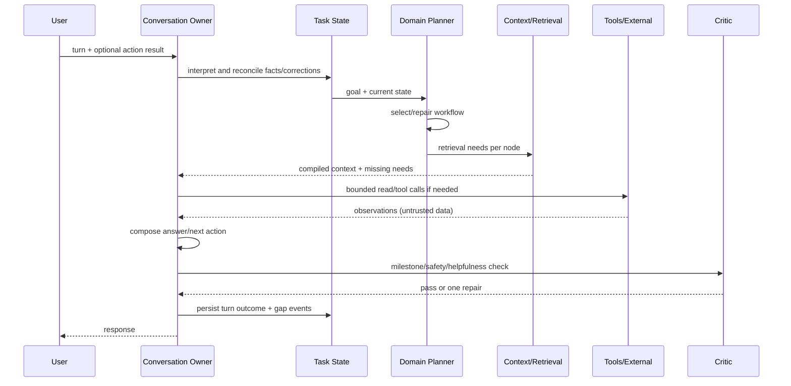

# Target architecture — BRAVO Consultant Intelligence Layer

## 1. Mục tiêu kiến trúc

Tạo một lớp candidate-neutral để model/runtime khác nhau vẫn thực hiện cùng hợp đồng tư vấn. Lớp này
phải trả lời được “tại sao và làm gì tiếp theo” trước khi tối ưu “dùng framework nào”.

## 2. Thành phần

### 2.1 Turn Interpreter

Input: user message, active `TaskState`, profile, identity/environment scope.  
Output: `TurnUpdate` gồm goal candidate, new/corrected facts, user action đã thực hiện, questions,
requested output và urgency/risk cues.

Interpreter không được tự ghi memory dài hạn. Mọi update đi qua reconcile policy.

### 2.2 GoalFrame

```yaml
goal_id: uuid
goal_type: financial_statements_ready
desired_outcome: "BCTC kỳ 06/2026 đúng và đối chiếu được"
module_scope: [GL, AP, AR, CASH, INVENTORY, FA]
time_scope: {period: "2026-06", status: asserted}
environment_ref: env:unknown
known_facts: []
constraints: []
assumptions: []
open_questions: []
risk_tier: advisory
confidence: 0.0
status: active
```

Goal type là outcome, không phải tên corpus. Một turn có thể mở subgoal nhưng chỉ một active focus
được dùng để compose response.

### 2.3 TaskState

```yaml
task_id: uuid
goal_id: uuid
workflow_id: wf.financial-close.v1
workflow_version: 1.0.0
current_nodes: [reconcile_subledgers]
node_state:
  validate_posting: completed
  reconcile_subledgers: in_progress
facts:
  - key: period
    value: "2026-06"
    source: user
    observed_at: "2026-07-14T...Z"
    status: active
contradictions: []
pending_questions: []
tool_observations: []
plan_revision: 3
```

Mỗi fact có source, scope, time và status. Correction tạo event `supersedes`; không xóa dấu vết.

### 2.4 Domain artifacts

#### GoalCard

Mô tả outcome, dấu hiệu hoàn thành, anti-goals, terminology và workflow candidates. Ví dụ
`financial_statements_ready` không đồng nhất với `report_screen_opened`.

#### WorkflowCard

```yaml
id: wf.financial-close.v1
applies_when: [goal=financial_statements_ready]
version_scope: business_core
nodes:
  - id: validate_posting
    objective: "Không còn chứng từ cần hạch toán/ghi sổ trong phạm vi kỳ"
    preconditions: [period_known]
    evidence: [unposted_document_check]
    completion: "unposted_count = 0 hoặc exception được chấp nhận"
    next: [periodic_entries, reconcile_subledgers]
  - id: generate_and_validate_reports
    requires: [periodic_entries, reconcile_subledgers, closing_entries]
    forbidden_before: [critical_reconciliation_complete]
```

WorkflowCard không chứa menu giả định. Nó mô hình hóa nghiệp vụ ổn định và tham chiếu `ActionMap`.

#### ActionMap

Mapping workflow node sang thao tác BRAVO theo version/edition/config/environment. Có confidence,
source/provenance và `requires_confirmation`. Đây là nơi tên menu, form, report code, XML/layout và
tool binding sống.

#### DiagnosticCard/KEDB

Mô hình symptom, discriminators, hypotheses, evidence queries, verified resolution, version range,
known side effects, supersedes/deprecated và escalation owner. Similarity không đủ để gọi resolution
“đã xác minh”.

#### EnvironmentProfile

Chứa BRAVO version/build, edition, modules, DB/schema snapshot ref, customer-specific configuration
scope, permissions và data classification. User có thể chọn/khẳng định, tool có thể quan sát; hai loại
source không được lẫn.

### 2.5 Domain Planner

Planner làm bốn việc:

1. chọn/đề xuất GoalCard;
2. bind WorkflowCard và environment;
3. xác định current milestone và discriminator có information gain cao;
4. sinh `RetrievalNeed`/`ToolNeed` theo plan node.

Planner không tạo tự do một danh sách bước rồi coi đó là policy. Nếu chưa có card, plan được đánh
dấu `provisional` và sinh gap event.

### 2.6 Context Compiler

Thứ tự context đề xuất:

1. system/policy và authority cố định;
2. active goal + current workflow node + risk;
3. facts/constraints/corrections liên quan;
4. compact conversation summary và 2–4 raw turns gần nhất;
5. domain artifacts cần thiết;
6. retrieved evidence/tool observations;
7. output contract.

Compiler có token budget theo section, dedupe, conflict display và pointer tới raw events. Nó ghi
`ContextManifest` để eval biết model đã thấy gì.

### 2.7 Plan-aware Retrieval

Two-pass mặc định:

- Pass A: retrieve/resolve GoalCard và WorkflowCard từ intent + state.
- Pass B: với từng current/next node, tạo query theo artifact type: guide, business rule, ActionMap,
  schema, KEDB, policy.

Hybrid lexical/vector + metadata filter + rerank vẫn dùng được. Query result phải có `need_id` và
`plan_node_id`. Không tăng top-k nếu không biết thiếu node nào.

### 2.8 Capability Router

Router chọn một hoặc nhiều capability:

- `answer_from_domain_model`;
- `clarify_discriminator`;
- `retrieve_internal`;
- `inspect_schema_readonly`;
- `search_kedb`;
- `draft_action`;
- `request_approval`;
- `consult_external_expert`;
- `escalate_human`.

User có thể override profile/source preference, không thể override RLS, tool authority hoặc approval.

### 2.9 Response Composer và Task Critic

Response contract ưu tiên:

1. phản ánh đúng goal/current state;
2. trả lời trực tiếp phần có thể trả;
3. giải thích prerequisite/nhánh quan trọng vừa đủ;
4. đưa next action cụ thể;
5. nêu assumption/uncertainty tại đúng claim;
6. hỏi tối đa các discriminator cần thiết;
7. source link chỉ khi giúp kiểm tra hoặc risk yêu cầu.

Critic chạy nhẹ, có thể deterministic + model judge, kiểm tra:

- có nhảy qua forbidden prerequisite không;
- có specificity về schema/version/case ID không evidence không;
- có mâu thuẫn TaskState không;
- có next action không;
- câu hỏi có thực sự đổi nhánh không.

Critic không được tạo “vòng lặp sửa vô hạn”; tối đa một retry online.

### 2.10 Memory plane

| Loại | Scope | Ví dụ | Write policy |
|---|---|---|---|
| Transcript | conversation | raw messages/events | append-only |
| Task state | active task | kỳ, node, constraints | reconcile per turn |
| User preference | user | cách trình bày | explicit/confirmed |
| Environment fact | tenant/env | version/module | tool/owner/expiry |
| Organization knowledge | BRAVO | workflow/KEDB | governed promotion |
| Episodic summary | session/task | decisions/progress | checkpoint + validate |

Không học tri thức tổ chức trực tiếp từ memory người dùng.

### 2.11 Gap và evaluation plane

`KnowledgeGapEvent` chứa goal/node, missing artifact type, attempted queries, answer impact, risk,
external/human outcome và cluster key. Autonomous jobs chỉ tiêu thụ event này, tạo candidate và chạy
eval; promotion là bước riêng.

## 3. Online turn sequence



## 4. Uncertainty và evidence tiers

| Tier | Claim | Yêu cầu |
|---|---|---|
| U0 | reasoning/khái niệm kế toán phổ quát | answer trực tiếp, caveat khi policy-dependent |
| U1 | workflow BRAVO chuẩn đã được SME duyệt | card version + internal provenance |
| U2 | tên menu/config theo version | ActionMap hoặc nêu giả định + hỏi version |
| U3 | schema/customer/environment fact | read-only tool/snapshot bắt buộc |
| U4 | production-changing action | draft + validation + approval + durable execution |

Citation trong UI có thể gọn ở U0–U1. Trace/provenance luôn lưu cho U1–U4. Điều này tránh biến UX
thành pháp lý nhưng vẫn ngăn “biết như thật” ở schema/production.

## 5. Deployment boundaries

- Consultant layer không tự thực thi SQL/XML/config.
- Tool request đi qua control plane cũ với identity/RLS/policy/audit.
- Durable engine sở hữu checkpoint/resume/cancellation, không sở hữu domain semantics.
- Domain artifacts và eval suite không phụ thuộc model vendor/runtime candidate.
- External response được bọc `ExternalObservation`, luôn là untrusted content.

## 6. Technology posture

- Pydantic/JSON Schema cho contract; PostgreSQL JSONB + Git-reviewed YAML ở giai đoạn đầu.
- Existing hybrid retrieval được mở rộng artifact types và plan-node tagging.
- Redis/vector store chỉ là index/cache, không là source of truth.
- OpenTelemetry/event envelope cho trace.
- Model nhỏ/structured output cho interpreter/critic nếu benchmark đạt; model mạnh hơn cho planning/
  composing theo complexity router.
- Graph database, full multi-agent, fine-tuning và autonomous production write đều nằm sau gate.

## 7. Architecture fitness tests

1. Thay model nhưng cùng input artifacts phải giữ được critical prerequisites.
2. Thay runtime/harness không làm đổi schema/task transition.
3. Correction “không phải tháng 6, là tháng 5” phải supersede fact và repair plan trong một turn.
4. Không schema snapshot thì không được khẳng định bảng/field tồn tại.
5. User hỏi “BCTC” không được đề xuất generate trước forbidden prerequisite trong case chuẩn.
6. Một gap không được tự tạo organization knowledge active.
7. External source chứa instruction phải không thể gọi tool hoặc thay system policy.
8. Tắt external gateway vẫn hoàn thành task nội bộ không phụ thuộc nó.

