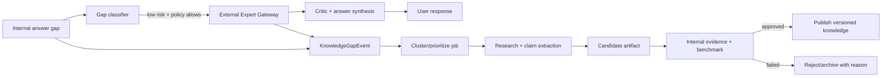

# Phase 4 — External expert gateway và autonomous candidate-knowledge jobs

**Mục tiêu:** dùng nguồn ngoài như BravoGen để giảm knowledge gap có kiểm soát, đồng thời xây vòng lặp
cải thiện tri thức không tự phát tán hallucination.  
**Thời lượng dự kiến:** 15–25 engineering days + continuous SME review.  
**Phụ thuộc:** Phase 0 gap benchmark, Phase 1 domain artifacts, Phase 2 privacy/state, Phase 3 retrieval
trace/critic.  
**Quyết định:** shadow trước; không bulk extraction hay live fallback âm thầm ở thời điểm bắt đầu.

## 1. Trả lời trực tiếp hai đề xuất

### 1.1 Có cần Autonomous Jobs để trích xuất từ BravoGen không?

**Có, nhưng chỉ dưới dạng candidate-knowledge jobs được gap-driven và evaluation-gated.** Không nên
chạy crawler hỏi hàng loạt để sao chép output thành corpus. Lý do:

- output BravoGen hữu ích nhưng benchmark black-box không chứng minh nguồn, workflow hay độ đúng;
- một câu trả lời có thể trộn nghiệp vụ đúng với menu/schema/issue cụ thể không kiểm chứng;
- bulk prompts tạo nhiều văn bản trùng lặp hơn là GoalCard/WorkflowCard/KEDB có cấu trúc;
- chi phí, quota, ToS và credential lifecycle trở thành dependency vận hành;
- raw external output có thể chứa prompt injection hoặc dữ liệu ngoài phạm vi.

Job đúng phải bắt đầu từ `KnowledgeGapEvent`, hỏi có mục tiêu, phản biện, phân rã claim, đối chiếu
nguồn nội bộ/schema/SME, rồi tạo **candidate artifact**. Job không được publish trực tiếp.

### 1.2 Có cần live fallback khi chatbot không trả lời được không?

**Có thể có, nhưng là capability có policy, không phải cổng tự xoay/tạo token.** Thứ tự rollout:

1. offline benchmark;
2. shadow call—không ảnh hưởng câu trả lời user;
3. analyst assist—supporter xem output và quyết định dùng;
4. live low-risk assist cho U0/U1 với disclosure và internal critic;
5. không dùng external-only output để khẳng định U3/U4 hoặc execute.

Không tự tạo account, xoay browser token để né quota, dùng cookie phiên cá nhân hoặc reverse-engineer
auth lifecycle. Chỉ dùng API/credential/service account được BRAVO và nhà cung cấp cho phép, có quota,
expiry và owner. Hai tài khoản test được người dùng cấp có thể phục vụ benchmark được ủy quyền, nhưng
không phải thiết kế production.

## 2. Tách hai luồng tuyệt đối

### Online Assist Plane

Mục tiêu: giúp turn hiện tại. Output là `ExternalObservation`, confidence thấp hơn internal verified
artifact, đi qua critic và response policy. Không ghi thẳng KB.

### Knowledge Improvement Plane

Mục tiêu: biến gap lặp lại thành artifact đã kiểm chứng. Chạy async, có clustering, claim extraction,
evidence matching, eval và promotion. Không tác động turn đang chờ trừ khi có human-in-loop rõ ràng.



## 3. ExternalExpertGateway contract

```yaml
request:
  request_id: uuid
  provider: bravogen
  profile: bravo-insight
  purpose: live_assist | offline_research | benchmark
  question: "...redacted..."
  context:
    goal_type: report_discrepancy
    bravo_version: "10.x"
    environment_facts: []
  data_classification: public_or_synthetic
  timeout_ms: 15000
  max_tokens: 1800
response:
  provider_request_id: "..."
  content: "..."
  structured_citations: []
  received_at: "..."
  latency_ms: 0
  trust: external_unverified
  policy_flags: []
```

Gateway có:

- credential broker/secret store; không log token;
- provider adapter, request allowlist và purpose binding;
- redaction/DLP trước egress;
- per-provider/user/tenant quota, concurrency và cost budget;
- cache theo normalized safe question + provider/profile/version;
- timeout/retry có idempotency, circuit breaker và kill switch;
- response size/content sanitization;
- full audit metadata, nhưng raw sensitive input theo TTL/policy;
- provider ToS/data-retention register.

Provider output luôn nằm trong data-delimiter; instruction từ output không được đổi policy/gọi tool.

## 4. Gap classifier

Không gọi external chỉ vì retrieval top score thấp. Classifier dùng:

- goal/workflow có card không;
- required RetrievalNeeds nào thiếu;
- risk/evidence tier;
- answer draft còn hữu ích đến đâu;
- user đã cấp consent/scope nếu cần;
- expected information gain và latency budget;
- external provider có competency/profile phù hợp không;
- cache/previous candidate có sẵn không.

### Decision table

| Gap | Online action | Improvement action |
|---|---|---|
| Thiếu fact user | hỏi targeted question | không external |
| Thiếu schema/environment | read tool/human | ingest snapshot gap |
| Thiếu workflow U0/U1 | best-effort + external nếu allowed | candidate Goal/WorkflowCard |
| Thiếu exact BRAVO step U2 | external/SME, label version uncertainty | candidate ActionMap |
| Troubleshooting chưa có resolution | evidence ladder + similar issue | candidate DiagnosticCard |
| U3/U4 | không external-only claim/execute | human/verified tool path |
| Provider down/quota | internal best effort + gap event | retry offline, không block user lâu |

## 5. Autonomous job pipeline

### J1 — Cluster và prioritize

Gom gap theo normalized goal/node/artifact type/version, không theo embedding user text duy nhất.
Priority = frequency × user impact × strategic coverage × solvability; risk tăng review requirement,
không tự động tăng auto-publish.

### J2 — Research plan

Sinh bộ câu hỏi tối thiểu:

- hỏi giải pháp chính;
- hỏi prerequisites và exceptions;
- hỏi version/environment applicability;
- hỏi phản biện: “trường hợp nào hướng dẫn này sai?”;
- hỏi source/issue/schema evidence;
- tạo contrast case cùng triệu chứng khác nguyên nhân.

Có thể dùng 3 profile BravoGen khi domain phù hợp, nhưng profile mismatch response là dữ liệu đánh giá
routing, không ground truth.

### J3 — Claim extraction

Tách output thành atomic claims và phân loại: business-general, BRAVO workflow, exact action, schema,
issue/resolution, policy, risky action. Mỗi claim có support status và contradiction list.

### J4 — Internal verification

- search tài liệu/corpus;
- schema read/snapshot nếu authorized;
- issue/KEDB match;
- compare nhiều response/profile/prompt chỉ để phát hiện bất nhất;
- SME review theo risk.

Agreement giữa hai model/provider không biến claim thành verified.

### J5 — Candidate artifact generation

Sinh GoalCard/WorkflowCard/ActionMap/DiagnosticCard draft với owner/version/applicability/source refs,
không sinh một bài Q&A dài làm mặc định.

### J6 — Eval

Chạy affected benchmark + counterexamples + injection/safety suite. So sánh task lift, regression,
unsupported specificity và latency.

### J7 — Promotion

| Risk class | Promotion |
|---|---|
| Business explanation, không BRAVO-specific | auto-candidate; sampling review; không auto-active ban đầu |
| Workflow/BRAVO action | SME approve |
| Schema/version/issue resolution | owner + evidence bắt buộc |
| Policy/ISMS | policy owner approve |
| Script/config/DB change | không publish executable; security/DBA/approval workflow |

Mọi promotion tạo content version/event; rollback được; rejected candidate lưu reason để job không
lặp lại vô hạn.

## 6. BravoGen benchmark findings dùng cho gate

Tập 66 lượt hiện tại trong `app/eval/bravogen_benchmark.example.yaml` và artifact run tương ứng cho
thấy các profile có behavior domain khác nhau. Một số câu trả lời insight hữu ích về hướng dẫn,
technical và safety; ISMS/user-guide có xu hướng redirect khi lệch profile. Tuy nhiên:

- chưa có structured citations machine-readable trong run; một số content có inline source string;
- có case schema không có snapshot/version nhưng response vẫn khẳng định table cụ thể;
- có case similar issue nêu case/version/resolution cụ thể như verified mà thiếu provenance kiểm chứng;
- đây là evidence về **behavior**, không chứng minh implementation nội bộ.

Vì vậy BravoGen phù hợp shadow comparator và candidate source; chưa đạt tiêu chuẩn truth source cho
schema/KEDB/production.

## 7. Work packages

| ID | Task | Owner | Estimate | Dependency | Deliverable |
|---|---|---|---:|---|---|
| P4-01 | Legal/ToS/data/credential review | Security/product | 2–4d | provider contact | provider register |
| P4-02 | Gateway/provider-neutral contract | Architect/backend | 2–3d | P4-01 | interface |
| P4-03 | BravoGen adapter + secret broker | Backend | 3–5d | official auth | adapter |
| P4-04 | Redaction/quota/cache/circuit breaker | Platform/security | 4–7d | P4-02 | gateway controls |
| P4-05 | Gap classifier/policy | AI/backend | 3–5d | P1/P3 traces | decision service |
| P4-06 | Shadow evaluation | Eval | 3–5d | P4-03/05 | lift/risk report |
| P4-07 | Gap cluster/prioritize job | Data/AI | 3–5d | gap events | job J1 |
| P4-08 | Research/claim/candidate pipeline | AI/backend | 6–10d | P4-07 | jobs J2–J5 |
| P4-09 | Promotion/review workflow | Knowledge/backend | 4–7d | artifact schemas | review queue |
| P4-10 | Regression/publish/rollback | Eval/platform | 3–5d | P4-08/09 | J6–J7 |
| P4-11 | Analyst-assist then live canary | Support/product | 3–5d | gates | canary report |

P4-01/02 và offline job design có thể song song. P4-11 không bắt đầu trước shadow report.

## 8. Acceptance gates

### Shadow → analyst assist

- ≥100 eligible gap turns hoặc đủ power theo pre-registered analysis;
- external adds SME-rated useful information ≥30% eligible cases;
- unsupported-specificity rate không cao hơn internal baseline sau critic;
- redaction tests 100%, prompt-injection tool escape 0;
- p95/cost/quota rõ; kill switch tested;
- provider authorization/retention documented.

### Analyst assist → live low-risk

- ≥80% analyst acceptance ở suggested subset;
- end-to-end TMS +10% relative trên gap subset;
- no U3/U4 external-only claims;
- p95 user latency trong budget hoặc async UX;
- availability failure không làm internal chat fail;
- disclosure/feedback UX được product duyệt.

### Candidate jobs → production knowledge

- 0 direct raw-output publish;
- 100% active artifacts có owner/version/applicability;
- affected benchmark không regression >2 points, critical regression = 0;
- promotion/rollback audit hoàn chỉnh;
- lead time và acceptance rate chứng minh job tiết kiệm SME effort so với manual baseline.

## 9. Stop/rollback conditions

- Token/cookie lộ log, cross-account/cross-tenant data, ToS ambiguity: stop provider immediately.
- Provider bắt đầu trả PII/instruction bất thường: circuit open + incident review.
- External lift <10% hoặc cost/latency vượt value sau 200 eligible turns: không live; giữ offline-only.
- Candidate acceptance <20% sau hai iteration: dừng generation, sửa gap/authoring schema.
- Hallucination được promotion: rollback artifact/version, re-run affected benchmark và root-cause.
- Không dùng auto account/token rotation như reliability mechanism trong bất kỳ tình huống nào.

## 10. Final recommendation

Xây interface/gap loop ngay từ kiến trúc, nhưng chỉ implement provider live sau Phase 0–3. Ưu tiên
autonomous **curation jobs** hơn autonomous **extraction jobs**: mục tiêu là nâng task competence của
BRAVO, không tích lũy số lượng câu trả lời của BravoGen.

