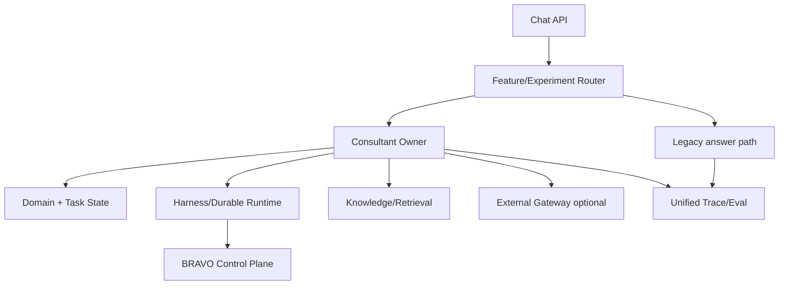

# Phase 5 — Runtime integration, rollout và operations

**Mục tiêu:** tích hợp consultant layer với runtime/control plane đã chọn, rollout dựa trên task
success và vận hành có rollback theo component.  
**Thời lượng dự kiến:** 20–35 engineering days tùy kết quả runtime spike.  
**Phụ thuộc:** exit gate Phase 1–3; Phase 4 live là tùy chọn, không chặn core rollout.

## 1. Nguyên tắc tích hợp với decision pack cũ

Pack [Frontier Agent Runtime 2026-07-13](../FRONTIER-AGENT-RUNTIME-DECISION-PACK-2026-07-13.md)
chọn ranh giới ba lớp: harness, durable engine, BRAVO control plane. Pack này thêm consultant layer
trên harness nhưng giữ candidate-neutral interface.

| Consultant responsibility | Runtime responsibility | Control-plane responsibility |
|---|---|---|
| goal/task/workflow semantics | invocation, checkpoint, retry, resume | identity, RLS, policy, approval |
| context/retrieval needs | model/tool orchestration | audit, domain verifier, egress |
| answer/clarify/escalate decision | durable state transition | maker-checker/tool authority |
| knowledge gap/candidate | job scheduling/execution | publish permission/governance |

Không để DBOS/LangGraph/Agents SDK session object trở thành canonical `TaskState`. Adapter phải map
runtime events sang contract BRAVO.

## 2. Integration contracts

### Invocation

`ConsultantInvocation {identity_ref, conversation_id, task_id, turn_id, profile, input_ref,
runtime_budget, environment_ref}`.

### Checkpoint

Checkpoint gồm refs/version của GoalFrame, TaskState, workflow, context manifest, outstanding tool/
approval, prompt/model/config. Không nhét raw secrets/tool payload vào checkpoint.

### Outcome

`ConsultantOutcome {response, task_state_revision, milestone_delta, evidence_refs, gap_events,
pending_action, eval_tags}`.

### Cancellation/resume

- Cancel trước side effect: stop và mark cancelled.
- Cancel khi chờ approval: revoke pending request theo policy.
- Cancel sau committed side effect: không giả rollback; record compensation/escalation.
- Resume luôn reload authority/environment freshness và workflow version before continuing.

## 3. Deployment topology

Feature assignment theo conversation/task, không theo turn để tránh behavior drift giữa lượt. Config
version pin trong task; emergency kill switch có thể ép legacy/safe-read-only.

## 4. Rollout stages

### R0 — Offline/replay

Replay benchmark và historical redacted conversations. Không tool ngoài fixture, không external live.

Gate: Phase acceptance; no critical regression; reproducible traces.

### R1 — Shadow

Consultant path xử lý song song nhưng user nhận legacy answer. So sánh goal/plan/answer bằng evaluator
và SME sample; tool calls mock/read-only cache.

Gate: TMS lift, cost/latency projection, policy parity.

### R2 — Internal dogfood

Nhân viên BRAVO/support tự chọn consultant mode, có nút report wrong goal/step. Chỉ advisory/read-only.

Gate: ≥200 eligible tasks, sustained lift, correction UX works, no data isolation incident.

### R3 — 5% canary

Ba workflow core, auto route + visible profile, legacy fallback on service failure. External gateway off
hoặc shadow-only.

Gate: SLO 2 tuần, critical task success, support ticket rate không xấu.

### R4 — 25–50% expanded

Mở 10 workflows, read tools, memory/compaction. Draft action chỉ khi approval/durability gates của
pack cũ đạt.

### R5 — Default

Consultant path mặc định; legacy retained for rollback window. External low-risk assist có gate riêng.

### R6 — Governed actions

Draft → validate → approval → durable execute theo control plane. Đây là rollout độc lập khỏi answer
quality và cần security/DBA/finance sign-off.

## 5. SLO/SLA và budgets

Đề xuất ban đầu, hiệu chỉnh bằng Phase 0:

- availability advisory path ≥99.5%; external dependency không nằm trên critical availability path;
- first meaningful response p95 ≤8s cho no-tool, ≤15s read-tool; streaming có thể giảm perceived latency;
- hard runtime/tool/token/cost budget theo task class;
- no-progress max planner iterations = 2 online;
- context compile/retrieve timeout có graceful degradation;
- critical security/authority violation = 0;
- Task Milestone Success được báo theo workflow/version, không chỉ global average.

## 6. Observability

Dashboard bắt buộc:

- traffic theo profile/goal/workflow/model/config;
- goal confidence, clarification, plan revision;
- milestone success/failure taxonomy;
- context tokens/manifest, retrieval need fulfilment;
- tool/external calls, timeout/cache/quota;
- unsupported specificity/critic interception;
- correction retention/memory conflict;
- latency/cost/error;
- gap cluster/candidate/promotion lead time;
- safety/RLS/approval/audit events.

Alert theo rate và absolute critical event. Không log raw prompt/response mặc định vào metric backend.

## 7. Operations runbooks

### Bad answer spike

Segment theo goal/workflow/config → compare trace manifest → classify goal/planner/retrieval/state/
composer → disable component version hoặc content artifact → replay affected benchmark → republish.

### Stale/wrong knowledge

Mark artifact quarantined/deprecated → index tombstone → affected task notification/replan → owner
review → regression eval → versioned restore. Không sửa nội dung im lặng.

### Memory/context incident

Kill semantic/long-term retrieval → preserve task ledger if safe → investigate scope/tenant → purge
theo refs → replay isolation suite.

### Provider outage/leak

Open circuit/kill gateway → internal best effort → revoke credential → audit request IDs → follow
incident/data policy. Không xoay sang account cá nhân để duy trì service.

### Runtime/durable incident

Thực hiện runbook pack cũ: reconcile checkpoint/side effects/approval; consultant layer không tự retry
write action ngoài idempotency boundary.

## 8. Work packages

| ID | Task | Owner | Estimate | Dependency | Deliverable |
|---|---|---|---:|---|---|
| P5-01 | Candidate-neutral adapter | Runtime/backend | 4–7d | runtime spike | adapter |
| P5-02 | Checkpoint/resume mapping | Runtime/backend | 4–7d | P5-01/P2 | durable state |
| P5-03 | Feature/experiment assignment | Platform | 3–5d | config store | router |
| P5-04 | Unified trace/eval pipeline | Platform/eval | 4–7d | P0 contracts | dashboards |
| P5-05 | Failure/legacy fallback | Backend | 2–4d | P5-01 | graceful fallback |
| P5-06 | Offline/shadow deployment | Platform | 3–5d | P5-01/04 | R0/R1 |
| P5-07 | Dogfood UX/feedback | Frontend/product | 3–6d | R1 | R2 |
| P5-08 | Canary controls/SLO alerts | Platform | 3–5d | R2 | R3 |
| P5-09 | Content/config rollback | Knowledge/platform | 3–5d | versioning | runbook/tooling |
| P5-10 | Load/chaos/security eval | QA/security | 5–8d | R3 candidate | gate report |
| P5-11 | Expanded/default rollout | Cross-team | ongoing | gates | R4/R5 |
| P5-12 | Governed action integration | Runtime/control | separate 10–20d | old-pack gates | R6 |

## 9. Acceptance/exit gate

- Consultant path thắng legacy ≥15% relative TMS tổng và ≥10% ở từng core workflow.
- Không workflow nào critical regression; harmful action/security violation = 0 in canary.
- Correction retention, unsupported specificity và retrieval gates Phase 1–3 giữ trong production.
- SLO đạt 14 ngày ở R3 và 30 ngày ở R4.
- Rollback full path <15 phút; artifact/config rollback <5 phút; đã diễn tập.
- Restart/resume/duplicate request/approval/cancel chaos scenarios pass theo pack cũ.
- Có owner trực cho runtime, knowledge, domain, eval và security; escalation matrix hiện hành.
- Product review xác nhận user nhận được next action hữu ích, không chỉ score tự động tăng.

## 10. Stop/rollback conditions

- Bất kỳ cross-tenant/privacy/tool authority incident: kill consultant/tool path ngay.
- TMS giảm >5% trong 2 cửa sổ liên tiếp hoặc harmful action vượt threshold: rollback config/content.
- p95/cost >2× approved budget không có task lift tương ứng: dừng expansion.
- Runtime resume không xác định side-effect state: không mở write workflow.
- External provider issue chỉ tắt gateway; không rollback consultant core trừ khi coupling vi phạm thiết kế.

## 11. Definition of done

Production default chỉ được gọi “done” khi task success, SLO, rollback, content ownership, memory
governance và on-call cùng tồn tại. Framework migration hoàn thành nhưng câu trả lời chưa tốt không phải
completion của chương trình này.

