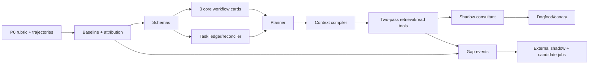

# Decision register và execution backlog

## 1. Architecture decision register

| ID | Quyết định | Status | Lý do | Revisit trigger |
|---|---|---|---|---|
| CI-001 | Giữ runtime pack cũ, thêm Consultant Intelligence Layer | Accepted proposal | hai vấn đề độc lập nhưng composable | runtime adapter không đáp ứng contract |
| CI-002 | Một conversation owner; specialist-as-tools | Accepted proposal | task ERP dùng shared state | independent-task benchmark chứng minh multi-agent lift |
| CI-003 | Typed GoalFrame/TaskState là canonical | Accepted proposal | transcript không đủ cho correction/resume | không có lift Phase 1/2 |
| CI-004 | Domain cards do BRAVO sở hữu | Accepted proposal | workflow/action/diagnostic là IP cốt lõi | authoring TCO vượt value |
| CI-005 | Two-pass plan-aware retrieval | Proposed experiment | retrieval phải phục vụ prerequisite | Phase 3 ablation thua one-pass |
| CI-006 | Tiered evidence; citation không là UX north star | Accepted proposal | helpfulness + safety theo risk | audit/regulatory requirement đổi |
| CI-007 | GraphRAG defer/gated | Accepted proposal | ontology/TCO chưa có evidence | relation failure ≥15% và spike gate |
| CI-008 | Fine-tuning defer sau Phase 3 | Accepted proposal | sửa context/state/tool trước | repeated behavior gap còn tồn tại |
| CI-009 | BravoGen external-unverified, shadow first | Accepted proposal | output useful nhưng provenance không đủ | official verified API/data contract mới |
| CI-010 | Không auto account/token rotation | Accepted proposal | security/ToS/operational integrity | không revisit trừ official service account mechanism |
| CI-011 | Autonomous jobs tạo candidate, không auto-publish | Accepted proposal | tránh feedback loop hallucination | risk-tier eval chứng minh safe automation |
| CI-012 | TMS/milestone là north star | Accepted proposal | component proxies không đo hiểu nghiệp vụ | product outcome metric tốt hơn được xác nhận |
| CI-013 | Memory tách transcript/task/user/env/org | Accepted proposal | scope/authority/lifecycle khác nhau | storage solution ép coupling không thể tránh |
| CI-014 | Risky action là workflow approval, không profile | Accepted proposal | prompt/mode không cấp authority | none |

Status chỉ chuyển sang `Accepted` sau design review; bảng hiện ghi “Accepted proposal” để thể hiện pack
đã chọn hướng nhưng chưa đại diện phê duyệt tổ chức.

## 2. Critical path

Fastest meaningful slice không phải full platform. Đó là:

`BCTC + AP invoice + report discrepancy` → typed goal/workflow → offline eval → shadow.

Slice này kiểm tra cross-module planning, transaction workflow và diagnostics trước khi nhân rộng.

## 3. First 30 working days

### Days 1–5 — Align và baseline foundation

- [ ] `P0-01` rubric/failure taxonomy workshop.
- [ ] `P0-02` chốt 10 workflows và 3 core slice.
- [ ] `P0-03` data scope/redaction/SME access.
- [ ] Draft trajectory schema và 5 anchor cases.
- [ ] Freeze model/prompt/retrieval config baseline.
- [ ] Design review các contract GoalFrame/TaskState.

### Days 6–10 — Benchmark vertical slice

- [ ] 15+ scenarios/40+ variants đầu tiên.
- [ ] Mutable simulator cho correction/user-action.
- [ ] Context/retrieval trace manifest tối thiểu.
- [ ] Chạy baseline và manual workflow-injection experiment.
- [ ] SME calibration, sửa rubric.

### Days 11–15 — Domain contracts và core cards

- [ ] JSON Schema/Pydantic contracts v1.
- [ ] Validator/CI cho card.
- [ ] GoalCards và WorkflowCards cho BCTC, AP invoice, report discrepancy.
- [ ] Unit tests forbidden-before/branch/correction.
- [ ] Authoring guide cho SME.

### Days 16–20 — Planner/state slice

- [ ] Turn Interpreter structured output.
- [ ] Deterministic State Reconciler.
- [ ] Domain Planner + provisional plan.
- [ ] Tiered response policy offline.
- [ ] Ablation trên anchor cases.

### Days 21–25 — Context/retrieval slice

- [ ] ContextBundle/Manifest.
- [ ] Plan-node RetrievalNeeds.
- [ ] Existing hybrid retriever adapter.
- [ ] Rule critic cho prerequisite/spec specificity.
- [ ] Long-turn correction tests.

### Days 26–30 — Shadow readiness decision

- [ ] Hoàn tất ≥30 scenarios/≥100 variants hoặc ghi gap lịch.
- [ ] Chạy full current vs consultant offline report.
- [ ] Security/privacy review typed state/trace.
- [ ] Chốt Phase 1/2 exit gaps.
- [ ] Quyết định: shadow 3 workflows, iterate, hoặc stop/reframe.

Không cam kết calendar nếu SME/data chưa sẵn sàng; ngày là sequence/effort planning, không deadline.

## 4. Epics và dependency-ready backlog

### EPIC A — Task benchmark

- A1 Schema/rubric/fixtures (`P0-01..05`).
- A2 Trace/baseline/comparator (`P0-06..08`).
- A3 Calibration/thresholds (`P0-09..10`).
- Deliverable gate: Phase 0 exit.

### EPIC B — Domain intelligence

- B1 Contract/validator (`P1-01..02`).
- B2 Catalog authoring (`P1-03..05`).
- B3 Interpreter/reconciler/planner (`P1-06..08`).
- B4 Answer policy/shadow (`P1-09..11`).

### EPIC C — Conversation/context

- C1 Memory policy/storage (`P2-01..03`).
- C2 Compiler/compactor (`P2-04..06`).
- C3 Resume/privacy/eval (`P2-07..10`).

### EPIC D — Knowledge/tool grounding

- D1 Need/metadata/index (`P3-01..04`).
- D2 Read tools/KEDB (`P3-05..06`).
- D3 Rerank/critic/eval (`P3-07..10`).

### EPIC E — External/gap improvement

- E1 Provider governance/gateway (`P4-01..06`).
- E2 Autonomous candidate jobs (`P4-07..10`).
- E3 Analyst/live canary (`P4-11`).

### EPIC F — Runtime/rollout

- F1 Adapter/checkpoint (`P5-01..02`).
- F2 Experiment/trace/fallback (`P5-03..05`).
- F3 Rollout/ops/actions (`P5-06..12`).

## 5. RACI tối thiểu

| Area | Accountable | Responsible/consulted |
|---|---|---|
| Product outcome/TMS | Product owner | SMEs, eval lead |
| Accounting workflows | Finance SME lead | implementation/support SMEs |
| BRAVO actions/version | Application owner | release/config owners |
| Schema/tools | DBA/platform owner | security, backend |
| KEDB | Support owner | engineering/QA |
| Domain schemas/planner | AI architect | backend, SMEs |
| Memory/privacy | Data/security owner | backend, product |
| Runtime/durability | Runtime owner | platform/control plane |
| External providers | Security/product owner | legal/procurement/platform |
| Eval/release gate | Eval lead | product, SMEs, QA |

Không có named accountable owner thì artifact/provider/workflow không được active production.

## 6. Required decision reviews

### DR-0 — Benchmark readiness

Inputs: scenario coverage, SME agreement, trace privacy, baseline reproducibility.  
Decision: Phase 1 start/iterate.

### DR-1 — Core architecture proof

Inputs: manual injection + three-workflow planner ablation, latency/cost.  
Decision: continue typed consultant layer, revise schema, hoặc stop.

### DR-2 — Memory/context canary

Inputs: correction/long-turn/isolation/compaction results.  
Decision: enable context/state shadow.

### DR-3 — Retrieval/tool canary

Inputs: need recall, U3 specificity, RLS/security, task lift.  
Decision: enable read tools/two-pass.

### DR-4 — External provider

Inputs: authorization, shadow lift, redaction/injection, cost/SLO.  
Decision: offline-only, analyst assist, live low-risk, hoặc reject.

### DR-5 — Production rollout

Inputs: TMS, safety, SLO, chaos/rollback, owner/on-call.  
Decision: canary/expand/default.

## 7. Research questions chưa đóng

| Question | Experiment/owner | Deadline gate |
|---|---|---|
| Model hiện tại có theo được WorkflowCard không? | E2/manual injection | DR-1 |
| Workflow nên granular mức nào? | author 3 core + token/TMS ablation | DR-1 |
| Card YAML hay DB authoring trước? | SME usability spike | DR-1 |
| Summary model hay deterministic template? | compaction ablation | DR-2 |
| Read schema tool coverage/freshness ra sao? | fixture + real authorized env audit | DR-3 |
| Reranker có cần train domain? | zero-shot vs tuned eval | DR-3 |
| BravoGen official API/ToS/SLA? | provider review | DR-4 |
| External response có lift sau internal Phase 3? | shadow study | DR-4 |
| Fine-tuning còn cần không? | error residual analysis | sau DR-3 |
| Graph relation bottleneck có đủ lớn? | failure attribution | sau DR-3 |

## 8. Program-level risks

| Risk | Early signal | Mitigation |
|---|---|---|
| SME bottleneck | cards/review queue stale | core slice, authoring templates, named owner |
| Benchmark overfit | offline up, dogfood flat | hidden variants, real conversation sampling |
| Card explosion | duplicate nodes/workflows | taxonomy/reuse/version review |
| Planner latency/cost | many retries/tool needs | complexity router, deterministic reducer, budgets |
| False confidence | exact BRAVO claims without U2/U3 evidence | critic + risk tier + tool |
| Context privacy | cross-task/user retrieval | scoped stores, isolation tests, TTL |
| Provider dependency | quota/outage changes UX | external optional, cache/circuit/internal fallback |
| Framework lock-in | runtime state leaks into domain schemas | adapters/contract tests |
| Autonomous feedback contamination | candidate promoted without proof | separate plane, promotion gates |
| UX becomes checklist dump | correct but unusable answers | current-node focus + next-action rubric |

## 9. Success after 90 days

Không đo bằng số tài liệu ingest hay số agent. Một kết quả có ý nghĩa gồm:

- 3–10 workflow production canary với TMS tăng rõ so với baseline;
- BCTC/AP/report-discrepancy cases hiểu prerequisite và current state;
- correction/resume không mất constraint;
- exact schema/version claims dùng tool hoặc uncertainty đúng;
- failure có attribution và sinh typed gap;
- ít nhất một knowledge candidate đi hết gap → review → eval → promotion → rollback drill;
- external provider, nếu dùng, đã chứng minh lift trong shadow và không là critical dependency;
- runtime candidate có thể thay mà không đổi domain contracts.

Nếu chỉ có framework mới, prompt dài hơn và nhiều chunk hơn mà các outcome trên không thay đổi, chương
trình chưa đạt mục tiêu.

