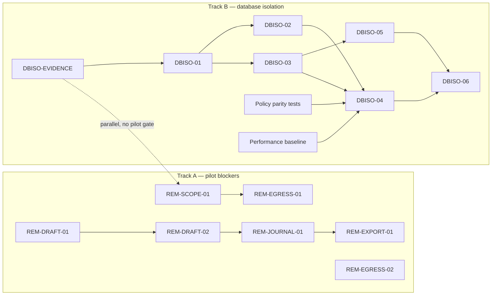

# T12 Remediation Index

## Track A — Pilot blockers

Track A implements the seven T10 blockers. It is independent of DBISO design, evidence collection, policy rollout, and database migration. Each package retains application-level enforcement even after PostgreSQL RLS is introduced.

| Package ID | Finding/ADR | Goal | Exact scope | Allowed files | Forbidden scope | Dependencies | Required tests | Migration/config impact | Rollback | Model | Effort |
|---|---|---|---|---|---|---|---|---|---|---|---|
| REM-SCOPE-01 | BRV-API-002 | Prevent an `own_dept` document writer from creating foreign or implicit shared scope. | **Trust boundary: source-write authorization.** Derive permissible department IDs from the authenticated principal; reject omitted/global and foreign scope unless an explicit all-scope/shared-publisher permission permits it. Preserve downstream source→chunk propagation; do not change it. | `app/api/routes_sources.py`; `app/security/auth.py`; `app/security/rls.py` only if a write-scope helper is required; `scripts/seed.py`, `app/api/routes_admin.py` only for scoped permission vocabulary; new focused source-scope test under `tests/`. | Sensitivity/classification; ingestion pipeline; embeddings/rerank; native RLS/roles; frontend redesign. | None. Must land before REM-EGRESS-01 because both alter the source-upload contract. | Two-department HTTP/integration matrix: own succeeds; omitted/global and foreign scope fail for `doc:create:own_dept`; explicit authorized publisher succeeds; foreign department cannot retrieve own-scoped source. | No migration. Permission seed/admin vocabulary change only if required to make the explicit publisher capability assignable. | Revert route/helper and permission-vocabulary change together; retain existing application read predicates. | 5.6 Terra | M |
| REM-EGRESS-01 | BRV-RAG-001 | Make upload sensitivity classification server-authoritative and sensitive-by-default before embedding. | **Trust boundary: ingest classification to embedding egress.** Stop treating caller `knowledge_type`/scope omission as sufficient to mark a source non-sensitive; establish trusted server policy and ensure private fixture blocks cannot call cloud embedding. | `app/api/routes_sources.py`; `app/security/sensitivity.py`; `app/ingestion/pipeline.py`; `app/rag/embedding.py`; `frontend-react/src/features/documents/DocumentsPage.tsx` and `features/chat/ChatView.tsx` only to remove/align untrusted classification inputs; focused ingestion/egress tests under `tests/`. | Department authorization semantics from REM-SCOPE-01; LLM reranking; provider/network deployment changes; RLS migrations. | REM-SCOPE-01 merged, because upload scope is an input to trusted classification. | Fake cloud embedding client + adversarial multipart inputs: private fixture remains sensitive regardless of caller metadata; no provider call; approved non-sensitive fixture follows the explicit trusted policy. | No schema migration. May add an internal classification enum/constant only; no cloud credential/config relaxation. | Restore prior classifier only if cloud embedding is disabled for all uploads; otherwise rollback is blocked by the same egress regression test. | 5.6 Terra | M |
| REM-EGRESS-02 | BRV-PLAT-001 | Prevent sensitive retrieved passages from reaching cloud LLM rerank. | **Trust boundary: retrieval to rerank egress.** Carry/derive sensitivity from selected passages; force local/no-rerank fallback when any candidate is sensitive; remove the hard-coded non-sensitive cloud call. | `app/rag/retriever.py`; `app/rag/rerank.py`; `app/llm/router.py` only for typed sensitivity handoff; focused rerank/router tests under `tests/`. | Source upload/classification; embedding provider; draft/accounting logic; RLS/role work. | None functional. Can be developed in parallel with the draft stream; merge after REM-EGRESS-01 to keep egress tests coherent. | Fake cloud chat client: sensitive scoped chunk produces zero cloud calls and deterministic local/fallback result; non-sensitive allowed path follows configured policy; rerank error fallback remains bounded. | No migration. No production provider credential change; package must test current enabled-cloud configuration safely with fakes. | Revert only with cloud LLM rerank disabled; otherwise the sensitive-rerank test prevents rollback. | 5.6 Terra | S |
| REM-DRAFT-01 | BRV-BIZ-001 | Require an explicit organizational owner for every normal financial draft. | **Trust boundary: draft creation scope.** Centralize department resolution at the draft-creation boundary; reject zero/multi-department ambiguity for non-admin creators; prohibit generic/AP paths from persisting NULL/global draft scope except through a separately explicit privileged path. | `app/erp/draft_queue.py`; `app/api/routes_drafts.py`; `app/accounting/ap_service.py`; focused draft/AP tests under `tests/`. | Approve/reject object lookup; journal schema/number validation; export status; RLS migration or shared/global redesign. | None. This is a Phase 0 direct fix and does not wait for DBISO-01. | Generic and AP create matrix for zero/one/multiple departments; no rejected case persists a row; valid scoped creator persists exactly its department; privileged exceptional path is explicit if retained. | No migration. No RLS policy change. | Revert creation guard only with pilot disabled; retain tests and existing read predicates. | 5.6 Terra | M |
| REM-DRAFT-02 | BRV-BIZ-002 | Enforce object scope in draft approve/reject service transitions. | **Trust boundary: financial workflow state transition.** Load draft through the existing scoped predicate inside both approval and rejection services before any transition/lock outcome; preserve maker-checker, hash, and audit behavior. | `app/erp/draft_queue.py`; `app/api/routes_drafts.py` only for stable non-enumerating error mapping; `tests/test_draft_queue.py`, `tests/test_draft_leak_probe.py`, and one focused DB integration test. | Draft creation; journal validation; export state; RLS policy implementation; changes to maker-checker rules. | REM-DRAFT-01 recommended first because it removes new NULL/global drafts; this package remains independently releasable. | Department A approver cannot approve or reject B draft by known UUID; B draft status/audit unchanged; A own draft retains maker-checker/hash behavior; all-scope actor behavior is explicit. | No migration. No DBISO dependency. | Revert service predicate only by reverting the release; no fallback to RLS-only protection is allowed. | 5.6 Terra | S |
| REM-JOURNAL-01 | BRV-BIZ-003 | Put journal schema and deterministic number validation at every generic financial-draft boundary. | **Trust boundary: financial payload integrity.** Allowlist draft kinds; validate journal payload on create, revalidate on approve, and validate before export. Keep the existing deterministic XML/agent path; reject malformed, unbalanced, unknown-account, or unsupported generic payloads. | `app/api/routes_drafts.py`; `app/erp/draft_queue.py`; `app/accounting/journal.py`; `app/accounting/journal_export.py`; focused accounting/draft tests under `tests/`. | Approval object scope from REM-DRAFT-02; frontend controls; export approval-status gate; RLS; changes to accounting policy/rules beyond invoking existing strict validator. | REM-DRAFT-02 merged to keep state transition tests separate; validator contract from existing accounting module. | Generic route accepts valid strict journal; malformed/unbalanced/unknown-account cases cannot be created, approved, or exported; valid XML/agent path remains compatible. | No migration. No provider/config change. | Revert validation adapter only if generic financial-draft endpoint is disabled; do not weaken typed accounting validators. | 5.6 Terra | M |
| REM-EXPORT-01 | BRV-FE-001 | Make approved state a mandatory backend gate for financial export and align UI affordances. | **Trust boundary: financial output/export.** Require `Draft.status == approved` for individual and batch journal export; return stable denial for pending/rejected/mixed batch; hide/disable corresponding frontend actions without relying on UI for enforcement. | `app/api/routes_drafts.py`; `frontend-react/src/features/chat/DraftCard.tsx`; `frontend-react/src/features/drafts/DraftsQueuePage.tsx`; `frontend-react/src/features/money/MoneyEnginePage.tsx`; frontend/API export contract tests. | Journal/payload validation; maker-checker logic; draft creation/approval scope; ERP integration; RLS migration. | REM-JOURNAL-01 merged so export assumes validated payloads. | Pending/rejected individual CSV/XLSX denied; mixed batch cannot return unsafe partial output; approved journal exports; direct API tests pass without frontend; UI test confirms unavailable controls. | No migration. No ERP configuration change. | Revert UI and route together only with export endpoint disabled; never restore pending/rejected export. | 5.6 Terra | S |

## Track B — Database isolation

Track B implements ADR-DB-001 incrementally. It is a defense-in-depth program and does not gate Track A or substitute for application authorization and business validation.

| Package ID | Finding/ADR | Goal | Exact scope | Allowed files | Forbidden scope | Dependencies | Required tests | Migration/config impact | Rollback | Model | Effort |
|---|---|---|---|---|---|---|---|---|---|---|---|
| DBISO-EVIDENCE | ADR-DB-001; T11 open evidence gaps | Establish a read-only production/staging fact base for DBISO rollout. | **Trust boundary: database operational evidence.** Collect PostgreSQL version, login role, ownership, grants/default privileges, superuser/BYPASSRLS, policies/FORCE state, legacy NULL/empty scope counts, session/memory orphans, MCP/worker/scheduled-job inventory, representative plans, and backup/restore command/credential model. | New evidence artifact `docs/reviews/2026-07/12-dbiso-evidence.md`; read-only external DB/ops commands; redacted command checklist in the artifact. | Any DB data/DDL/role/config change; production code; migration; secret values in artifacts. | None; runs in parallel with all Track A work. | Every checklist item has command, environment, timestamp, exit/result, and `VERIFIED` or `NEED FILE/CONTEXT`; no command is mutating. | None. If deployed access is unavailable, record exact commands and missing operator/context. | Not applicable; evidence only. | 5.6 Luna | S |
| DBISO-01 | ADR-DB-001; DBISO-EVIDENCE | Normalize durable scope and session-owner representations without enabling RLS. | **Trust boundary: database scope data model.** Add explicit scope-kind/creator/owner/session-anchor fields and constraints through additive migrations; backfill only verified rows; quarantine ambiguous legacy NULL/empty records; define service-principal schema only for observed execution paths. | `app/database/models.py`; new Alembic migration(s); schema-focused tests under `tests/`; migration data-audit utility under `scripts/` only if read-only/deterministic. | RLS policies/FORCE; database roles/grants; transaction hooks; route/tool authorization; financial business validation. | DBISO-EVIDENCE legacy scope and session-owner inventory. Track A remains independent. | Migration/backfill fixture matrix: explicit department/owner/shared states valid; missing scope rejected after cutover constraint; ambiguous legacy row quarantined; orphan session rows detected; downgrade path tested. | Additive migration, dual-write/backfill plan, later NOT NULL/constraint gate. No runtime role switch. | Keep additive columns and disable new write path; never auto-promote ambiguous records to shared. | 5.6 Terra | L |
| DBISO-02 | ADR-DB-001; DBISO-EVIDENCE | Establish least-privilege database role and privilege baseline. | **Trust boundary: database role authority.** Create/verify owner, app, MCP, worker, migrator, diagnostics, backup, and break-glass roles; revoke PUBLIC/excess grants; set default privileges; remove unfiltered views from trusted-boundary use. | New Alembic role/grant migration(s); deployment role/bootstrap scripts under `deploy/`; `docker-compose*.yml`/CI only for non-secret role wiring; role-catalog tests/scripts. | Row-level policies; principal context hook; application route permissions; data backfill; backup restore execution. | DBISO-EVIDENCE deployed role inventory; DBISO-01 table/action contract. | Catalog assertions: runtime owns no protected object; no superuser/BYPASSRLS; MCP read-only; worker limited; migrator DDL works; backup/break-glass bypass is explicit/audited. | Role/grant/default-privilege migration and deployment credential wiring. No application owner/DBA runtime fallback. | Restore the previous **restricted** grants through migrator; do not restore runtime owner/DBA credentials. | 5.6 Terra | M |
| DBISO-03 | ADR-DB-001 | Provide safe transaction-local principal context for pooled async sessions. | **Trust boundary: pooled connection context.** Implement immutable principal-bound session/UoW API; per-transaction `set_config(..., true)` binding; rollback/cancellation/streaming/nested-transaction safety; fail closed on absent context. | `app/database/__init__.py`; new `app/database/context.py` or equivalent; `app/security/auth.py` only for HTTP binding adapter; focused async pool/context tests under `tests/`. | RLS policy SQL; role/grant migration; MCP token bootstrap; worker job-envelope changes; business service predicates. | DBISO-01 principal contract. Can proceed in parallel with DBISO-02 after DBISO-01. | Same physical pooled connection A/B; multi-commit rebind; exception/rollback/cancellation; nested transaction; no DB transaction across simulated stream/LLM wait; missing context denies. | Application session-factory/UoW configuration only. No session-scoped `SET`; no DB policy activation. | Feature-disable context factory while policies remain shadow/disabled; retain existing session factory as compatibility path. | 5.6 Terra | M |
| DBISO-04 | ADR-DB-001 | Add PostgreSQL RLS backstop and write-time scope enforcement. | **Trust boundary: database row/write isolation.** Create hardened policy helpers and SELECT/INSERT/UPDATE/DELETE `USING`/`WITH CHECK` policies; enable/FORCE RLS; enforce source/mapping/chunk scope consistency, owner/session rows, drafts, and append-only audit semantics. | New Alembic policy migration(s); database SQL helper definitions; DB RLS integration/performance tests under `tests/`; migration verifier. | HTTP/MCP authentication design; worker payload model; route/service authorization; maker-checker; journal validation; frontend export. | DBISO-01, DBISO-02, DBISO-03 complete; policy-parity tests exist; representative performance baseline exists; DBISO-05 must complete before enforcement cutover. | Foreign SELECT/INSERT/UPDATE/DELETE denial; shared-publisher matrix; owner/session matrix; policy parity against application predicates; role catalog; vector/lexical plan and recall regression suite; `BRV-BIZ-002` app test passes with and without RLS. | RLS/helper/constraint migrations; shadow/canary then ENABLE/FORCE cutover. No role switch before all app binaries are context-aware. | Disable/NO FORCE policies via migrator and return to DBISO-02 restricted roles plus application predicates; retain scope schema and direct Track A fixes. | 5.6 Terra; Sol escalation gate | XL |
| DBISO-05 | ADR-DB-001 | Bind MCP and worker execution to explicit, least-privilege principals. | **Trust boundary: non-HTTP principal propagation.** Split MCP token bootstrap from protected query; use MCP read role/context; add principal/capability/request metadata to user-triggered worker jobs; register scheduled service principals and fail closed when absent/revoked. | `app/mcp/server.py`; `app/worker.py`; `app/security/auth.py` bootstrap resolver only; queue/job adapter files directly required by `app/worker.py`; focused MCP/worker tests; deployment config only for separate role URLs/identities. | RLS policy semantics; HTTP route permissions; source classification; financial tools; generic queue redesign. | DBISO-EVIDENCE job inventory; DBISO-01 principal/service schema; DBISO-03 context API. Can run alongside DBISO-04 shadow development. | MCP valid/revoked/invalid token scope tests; MCP role cannot write; worker missing/revoked principal fails; source-scope ingestion cannot broaden chunks; scheduled job requires explicit capability. | Job-envelope compatibility migration; MCP/worker role connection configuration; no implicit global service principal. | Disable MCP/job path or retain synchronous user path; never fall back to unscoped/global worker execution. | 5.6 Terra | M |
| DBISO-06 | ADR-DB-001 | Verify restoration, catalog state, and operational bypass controls before RLS enforcement completion. | **Trust boundary: recovery and privileged operations.** Add policy/catalog verifier, backup/restore preflight/runbook, break-glass audit requirements, isolated restore drill, and enforcement cutover checks. | `scripts/backup.sh`; new restore/verification script under `scripts/`; `deploy/` runbook/checklist; CI job only for static/catalog verification; tests for verifier/restore metadata. | New RLS policy design; normal request code; accounting/business logic; data-retention policy. | DBISO-02, DBISO-04, DBISO-05; external backup/restore evidence. | Restored isolated target preserves owners, grants, default privileges, helpers, policies, FORCE flags; negative isolation suite passes; backup credential cannot be used by runtime; break-glass audit is observable. | Backup/restore operational configuration and CI/static verification. Restore drill uses isolated target only. | Keep restored target offline or revert enforcement to DBISO-02 restricted-role state; no production data overwrite as rollback mechanism. | 5.6 Terra | M |

## Dependency graph

The arrows below are implementation dependencies. The numbered Track A order is the recommended merge/release sequence, not a claim that all seven fixes must be implemented in one branch.

### Recommended execution order

1. `REM-SCOPE-01`
2. `REM-EGRESS-01`
3. `REM-EGRESS-02`
4. `REM-DRAFT-01`
5. `REM-DRAFT-02`
6. `REM-JOURNAL-01`
7. `REM-EXPORT-01`

`DBISO-EVIDENCE` starts in parallel at step 1. Do not start DBISO-04 until DBISO-01, DBISO-02, DBISO-03, policy-parity tests, and a representative performance baseline are complete. DBISO-05 may be built in parallel with DBISO-04 shadow work, but must complete before RLS enforcement cutover.

## Parallel execution opportunities

| Parallel lane | Can run together | Constraint |
|---|---|---|
| Evidence lane | `DBISO-EVIDENCE` with every Track A package | Read-only; no database or code mutation. |
| Egress versus drafts | `REM-EGRESS-02` with `REM-DRAFT-01` → `REM-DRAFT-02` | No shared production files; retain separate fake-provider and financial-state test fixtures. |
| DBISO preparation | `DBISO-02` and `DBISO-03` after DBISO-01 | DBISO-02 owns role/grant files; DBISO-03 owns session/UoW files. |
| Non-HTTP principals | `DBISO-05` with DBISO-04 policy development after DBISO-03 | DBISO-04 enforcement cannot cut over before DBISO-05 is verified. |
| Frontend alignment | REM-EXPORT UI test work after backend status contract is specified, while REM-JOURNAL tests complete | Backend approved-status test remains the security gate; UI work must not redefine it. |

Packages that share `app/api/routes_sources.py` (`REM-SCOPE-01`, `REM-EGRESS-01`) or `app/erp/draft_queue.py`/`app/api/routes_drafts.py` (`REM-DRAFT-01`, `REM-DRAFT-02`, `REM-JOURNAL-01`, `REM-EXPORT-01`) should not be edited concurrently in the same worktree.

## Pilot completion gate

Pilot completion requires all Track A packages to be implemented, independently reviewed, and verified in a usable CI/integration environment:

- The seven required T10 regression matrices pass: source-write scope, ingest-to-embedding no-egress, sensitive rerank no-egress, draft-creation scope, foreign approve/reject denial, invalid journal lifecycle denial, and approved-only individual/batch export.
- The direct API/service tests run against a database-capable test environment; fake provider tests prove zero egress without relying on production credentials.
- Current cloud-enabled paths are tested under the secure classification/rerank rules before pilot use.
- No Track A test is replaced by an RLS test, UI test, prompt instruction, or manual ERP procedure.
- DBISO work is not a pilot completion dependency. `DBISO-EVIDENCE` should have an assigned operational owner and a recorded outcome, but DBISO-01 through DBISO-06 may continue after pilot provided Track A remains enforced.

The current missing Python/pytest toolchain recorded by T9 means this gate cannot be claimed complete until tests run in CI or another supported isolated environment.

## Architecture escalation conditions

Stop the affected DBISO package and route it to Sol only when one of these facts is established:

- The implementation requires changing ADR-DB-001 rather than applying its Hybrid model.
- The schema cannot represent explicit scope without a material redesign beyond DBISO-01’s additive/backfill/quarantine plan.
- The transaction hook cannot prove transaction-local context for every transaction, including multi-commit, cancellation, streaming, and pool reuse.
- MCP token bootstrap cannot be separated from protected query execution.
- The worker principal/capability model conflicts with the actual queue or runtime behavior.
- RLS policy parity, vector/lexical recall, or p95 performance exceeds the ADR threshold after normal optimization.
- Mixed-version deployment cannot keep old binaries fail closed during context/role/policy cutover.

Do not escalate for ordinary implementation choices, focused schema migrations already covered by DBISO-01, role/grant mechanics in DBISO-02, or direct Track A fixes.

## Remaining blockers and evidence

| Item | State | Effect on packages |
|---|---|---|
| Usable Python/pytest toolchain | NEED FILE/CONTEXT | Blocks empirical Track A completion and DBISO integration tests; CI can satisfy it. |
| Deployed PostgreSQL role/grant/policy inventory | NEED FILE/CONTEXT | Blocks DBISO-02 finalization and DBISO-04/06 cutover; does not block Track A. |
| Legacy NULL/empty scope classification and session-owner orphan counts | NEED FILE/CONTEXT | Blocks DBISO-01 backfill and policy enablement; does not block Track A. |
| MCP/worker/scheduled-job inventory and actual credentials | NEED FILE/CONTEXT | Blocks DBISO-05 and RLS cutover for non-HTTP paths; does not block Track A. |
| Representative query plans and production-like performance baseline | NEED FILE/CONTEXT | Blocks DBISO-04 enforcement, not policy development or Track A. |
| Backup/restore command and credential model | NEED FILE/CONTEXT | Blocks DBISO-06 operational sign-off only. |

No production code, configuration, migration, database, or test was changed by T12-0; this artifact is planning only.
