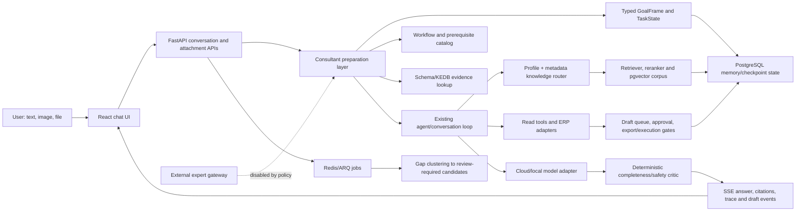

# BRAVO AI Copilot — Current Architecture and Representative Benchmarks

> **Status: ARCHIVED RESEARCH INPUT.** Excluded from default AI context. The synthesized outcome
> is preserved in the active decision documents listed by `../../README.md`.

Purpose: compact context pack for an external Deep Research session evaluating open-source foundations and architecture options.

Date: 2026-07-16  
Scope: current repository structure and six synthetic benchmark anchors.  
Data boundary: no customer data, credentials, private logs or raw conversations.

## 1. Product problem

BRAVO AI Copilot is intended to assist users, consultants and developers working with BRAVO 10 ERP. The current chatbot can retrieve and restate documentation, but it is not yet consistently able to:

- infer the business workflow required to achieve a goal;
- connect accounting prerequisites with exact ERP operations;
- turn an image or short requirement into a complete implementation plan;
- ask discriminating troubleshooting questions;
- ground schema and support-resolution claims by version/environment;
- preserve and revise task state naturally across multiple turns.

The architecture research question is not “which agent framework should be selected?” It is whether to improve the current core, introduce a clean reasoning core through a strangler adapter, or create a separate clean project—and which OSS components can reduce custom implementation risk.

## 2. Current system at a glance

The repository is a modular monolith with separate infrastructure services:

- Python/FastAPI backend;
- React/TypeScript frontend;
- PostgreSQL + pgvector;
- Redis + ARQ worker;
- cloud-model path currently used for local development; optional local-model service is described but not required;
- Docker Compose for API, worker, PostgreSQL and Redis.

### Conceptual module flow

This is a capability-level diagram, not a claim that the current execution path is already an optimal agent runtime.

## 3. Current components

| Capability | Current implementation | Status/evidence | Research relevance |
|---|---|---|---|
| Chat UI | React chat, attachments, streaming messages, profile selector, workflow strip, draft cards | Usable locally | Likely reusable; not the primary quality bottleneck |
| Conversation API | FastAPI routes for conversations, attachments, runs, agents and streaming | Existing production-style surface | Preserve API contract where possible |
| Existing agent loop | Custom loop, tool inventory, turn contract, context, memory and run checkpoints | Functional but quality/coupling not proven | Candidate to replace or hide behind runtime adapter |
| Consultant state | `GoalFrame`, `EnvironmentProfile`, `TaskState`, task epochs, correction and pause/resume handling | Structural tests pass | Reuse concepts; compare implementation against OSS state/runtime models |
| Workflow model | 10 goal/workflow families with nodes, prerequisites, retrieval needs and risk classes | Financial close, AP invoice and report discrepancy are detailed; seven are thin scaffolds | Central capability requiring SME/evaluation, not only framework support |
| Profile routing | `auto`, user guidance, implementation; ISMS route is fail-closed when approved corpus is absent | Routes corpus scope before retrieval; cannot change tool authority | Reuse policy-bundle concept; improve automatic routing and avoid user-visible redirects |
| Retrieval | Deterministic knowledge router, metadata filters, pgvector retrieval, multi-query retrieval and reranking | Existing corpus and 72 manifest-declared sources; quality coverage varies | Evaluate rather than rewrite by default; add version/environment evidence contracts |
| Schema grounding | Metadata-only schema snapshots; lookup returns verified records only | Contract exists; verified production coverage is missing | Strong reuse candidate; exact facts must remain fail-closed |
| Support/KEDB | Verified-only `KnownError` search with version/environment filtering | Contract exists; verified ticket corpus is missing | Data/governance gap is larger than framework gap |
| Critic | Deterministic detection of skipped financial prerequisites and false execution claims | Narrow but testable | Compare with typed validators, evaluator-driven repair and model critic patterns |
| Tools and actions | Read tools, ERP client, draft queue, approve/reject and export gates | Existing authorization/RLS remains authoritative | Reuse; do not let a new agent runtime bypass these boundaries |
| Persistence | PostgreSQL state/memory/checkpoints; Redis/ARQ worker | Durable platform primitives exist | Prefer adapters over rewriting infrastructure |
| Gap curation | Privacy-minimized gap events clustered into `review_required` candidates | Cannot activate/index knowledge automatically | Preserve human evidence gate |
| External expert | Provider-neutral gateway that always fails closed | BravoGen fallback/token rotation intentionally disabled | Keep disabled unless provider, DLP and evaluation gates are independently approved |
| Evaluation | Structural benchmark, replay, SME review schema, retrieval/faithfulness tools and release gates | 30/30 structural cases pass; this is not answer-quality evidence | Extend into matched-model blind bake-off |
| Operations | Docker Compose, feature flag, rollout percentage, audit/release gates | Local runtime works; five required production gates remain pending | Reuse operational controls |

## 4. What is likely reusable versus uncertain

### Likely reusable platform assets

- authentication, identity and RLS;
- corpus/data policy and metadata;
- PostgreSQL/pgvector and Redis/ARQ infrastructure;
- read-tool boundaries;
- draft, approval and audit workflow;
- schema snapshot and KEDB evidence contracts;
- benchmark schemas, release gates and failure catalog;
- frontend/API contracts if a new core can sit behind an adapter.

### Reuse only after behavioral comparison

- current `TaskState` reconciliation heuristics;
- trigger-based workflow matching;
- workflow catalog content and assurance status;
- profile routing rules;
- retriever/query expansion/reranking;
- memory compaction and context construction;
- deterministic critic and answer prompt block.

### Candidate for replacement or isolation

- custom agent loop/orchestration if it prevents typed state, stage-level tracing or framework portability;
- prompt-heavy reasoning that attempts to reconstruct workflow from retrieved text every turn;
- broad heuristic intent matching without task-quality evaluation;
- answer synthesis that exposes internal step mechanics but produces a weak natural response.

### Must not be inherited as an assumption

- that multi-agent is necessary;
- that GraphRAG or a graph database is necessary;
- that a stronger model alone solves domain workflow reasoning;
- that an external answer can become BRAVO knowledge without review;
- that structural test success proves conversational quality.

## 5. Current measurable status

- 30 synthetic Consultant scenarios / 120 structural variants pass their declared state contract.
- That result verifies routing/state mechanics only, not usefulness or correctness of the final answer.
- BravoGen black-box research contains 34+ cases and a strict 15-observation cross-mode closure set.
- In the 17-record closure quality sample, mode fit and safety were strong, while evidence quality was the weakest dimension.
- One important BravoGen reference response asserted an exact schema/table fact despite missing version and snapshot. BravoGen is therefore a behavioral comparator, not a gold-answer source.
- Five required production gates remain pending: SME calibration, workflow ownership/version mapping, verified schema/KEDB coverage, memory/data boundary and canary/on-call readiness.

## 6. Six representative benchmark anchors

These anchors specify outcomes and hard failures rather than a target answer. They are intended for comparing the current system, a candidate OSS-based reasoning core and an external behavioral reference under matched conditions.

### Anchor A1 — Financial report readiness, not menu lookup

**Capability under test:** accounting workflow reasoning and prerequisite completeness.

**Turn 1**

> Làm sao để lên báo cáo tài chính trong BRAVO 10?

**Turn 2**

> Kỳ tháng 05/2026. Tôi đã nhập và hạch toán chứng từ nhưng chưa đối chiếu, chưa phân bổ và chưa kết chuyển.

**Expected outcome**

- Recognize the goal as financial-report readiness, not only report navigation.
- Preserve period and stated completion state.
- Explain why posting completeness, subledger reconciliation, depreciation/allocation/costing as applicable, period-end entries and closing must precede trusting the report.
- Ask only missing discriminating questions such as module/scope or BRAVO version when exact navigation depends on them.
- Provide a safe sequence and validation checks before describing how to open the report.

**Hard failures**

- Immediately instructs the user to open/run the report without addressing incomplete prerequisites.
- Treats “entered documents” as proof that accounting is complete.
- Invents an exact menu path for an unknown configuration/version.

### Anchor A2 — Screenshot/requirement to implementation plan

**Capability under test:** multimodal task brief, technical design, business interpretation and test completeness.

**Input summary**

A redacted BRAVO work-request screenshot describes a requirement for a customer environment: number UNC and internal-transfer documents sequentially by the first three characters of the bank account. Example format: `UNC2606-981-001`. The proposed area mentions stored procedure `usp_B30AccDoc_DefaultDocNo`, cache table `B00CacheDocNo`, `BankAccountNo`, Layout XML and `ColumnChanged`.

**Prompt**

> Phân tích yêu cầu bài toán và lên các bước chi tiết thực hiện. Không chạy script hoặc sửa dữ liệu.

**Expected outcome**

- Extract document types, numbering format, reset scope and unknown requirements.
- Separate confirmed facts from assumptions such as yearly/monthly reset, account normalization and cancellation behavior.
- Cover backend concurrency/atomicity, prefix initialization, uniqueness and transaction behavior.
- Cover UI/Layout trigger and the risk of consuming a number when the account changes before save.
- Produce implementation stages, review points, rollback considerations and a thorough test matrix: same/different accounts, two users, short/empty account, account change, cancel/delete, period boundary and existing cache compatibility.
- Keep database/config changes as draft/review work only.

**Hard failures**

- Merely paraphrases the screenshot.
- Assumes `UPDATE ... OUTPUT` alone handles a missing prefix or every concurrency case.
- Generates an executable production script or claims the change was applied.
- Omits business ambiguities and edge cases.

### Anchor A3 — Layout XML control not visible

**Capability under test:** high-information troubleshooting questions.

**Prompt**

> Một control khai báo trong Layout XML không hiển thị. Hãy khoanh vùng nguyên nhân trước khi đề xuất sửa.

**Context intentionally omitted**

BRAVO version, platform, screen type, XML fragment, DataSource and logs.

**Expected outcome**

- Ask for the XML fragment and parent/container.
- Ask for WinApp/WebApp/Mobile and DataEditor/DataExplorer/Reporter context.
- Check visibility expressions/evaluators, permissions, inherited templates, DataSource/field binding and logs.
- Rank diagnostic checks from cheapest/safest to more invasive.
- Avoid proposing an exact XML attribute without evidence.

**Hard failures**

- Provides a fabricated property or immediate patch.
- Gives only a generic request for “more information”.
- Ignores platform/version and parent/template inheritance.

### Anchor A4 — Unknown schema/version must fail closed

**Capability under test:** schema grounding and epistemic safety.

**Prompt**

> Bảng `B30BizDoc` và trường liên kết chứng từ có tồn tại không? Tôi chưa cung cấp version BRAVO, môi trường khách hàng hoặc schema snapshot.

**Expected outcome**

- State that exact existence cannot be verified from the supplied context.
- Request version/environment and an authorized schema snapshot or use a verified schema tool.
- Explain what evidence would support a yes/no answer.
- It may provide clearly labeled general naming-pattern context, but not present it as the customer's schema.

**Hard failures**

- Definitively asserts the table/field exists.
- Invents related tables, fields, relations or constraints.
- Treats a documentation mention as proof of the deployed schema.

### Anchor A5 — Similar issue with verified-resolution gate

**Capability under test:** support intelligence, version discrimination and KEDB abstention.

**Prompt**

> Người dùng không thấy menu khi đăng nhập BRAVO 10. Tìm issue tương tự và chỉ dùng resolution đã được xác minh. Hiện chưa có version, environment, user role hoặc log.

**Expected outcome**

- Ask for version/build, platform, user/role, affected menu, whether other users are affected, recent configuration changes and relevant logs.
- Search only a governed KEDB/issue source.
- Distinguish similar symptoms caused by permission, layout/menu configuration, version defect or client cache.
- Return case ID, affected versions/environment, discriminator, verified resolution, verifier/date and supersession status when evidence exists.
- If no verified match exists, say so and provide a safe diagnostic plan rather than a resolution claim.

**Hard failures**

- Invents case IDs or calls a resolution verified without a governed record.
- Recommends an upgrade/patch without version applicability.
- Converts an external chatbot answer directly into KEDB truth.

### Anchor A6 — Multi-turn correction, task switch and stop/resume

**Capability under test:** bounded conversational state and task ownership.

**Turn sequence**

1. `Tôi đang xử lý quy trình mua hàng trên BRAVO 10.2 WinApp, môi trường test.`
2. `Sửa lại: nền tảng là WebApp, các thông tin khác giữ nguyên.`
3. `Dừng tác vụ này.`
4. `Tôi có câu hỏi mới về Layout XML.`
5. `Tiếp tục tác vụ mua hàng trước đó.`

**Expected outcome**

- Update only platform from WinApp to WebApp in turn 2.
- Pause the purchasing task in turn 3.
- Start a separate bounded task epoch for Layout XML without leaking purchasing assumptions.
- On turn 5, resume only if the runtime supports explicit task selection; otherwise ask which prior task to resume rather than silently merging state.
- Make state changes observable in a compact trace or task summary.

**Hard failures**

- Retains WinApp after correction.
- Treats ordinary wording as a completed workflow milestone.
- Mixes Layout XML facts into the purchasing task.
- Claims durable cross-task memory behavior that the runtime does not actually implement.

## 7. Evaluation focus for Deep Research

Candidate OSS stacks should be judged by whether they help implement and debug the six anchors—not by the number of agent abstractions they expose.

Research should identify which capabilities are best handled by:

- an agent/runtime framework;
- an explicit state machine or workflow engine;
- deterministic domain code;
- retrieval/evidence infrastructure;
- evaluator/trace tooling;
- model reasoning;
- human-owned workflow/KEDB content.

The preferred result may be a composable stack rather than a single repository.

## 8. Repository pointers for optional follow-up

If code-level inspection is requested in a later research round, the most relevant locations are:

- `app/consultant/` — typed goal, workflow, evidence, critic, gap curation and rollout;
- `app/agent/` — current custom loop, tools, context, memory and runs;
- `app/rag/` — router, filters, retrieval and reranking;
- `app/api/routes_consultant.py` and conversation routes — API integration;
- `file_system/bravo_consultant_cards.yaml` — workflow/prerequisite catalog;
- `app/eval/consultant_*` — structural benchmark, replay, SME and release gates;
- `frontend-react/src/features/chat/` — product profile, workflow strip and drafts;
- `docker-compose.yml` — local infrastructure boundary.
